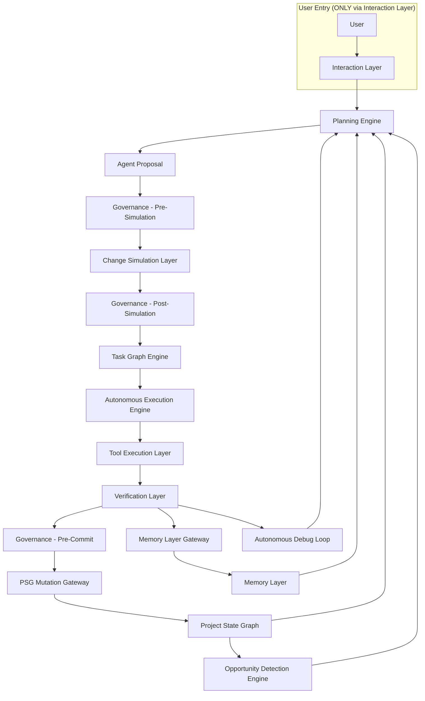

# AstraBuild: The Universal Autonomous Full-Stack Application Builder

> **Document Context:** This file serves as the definitive, timeless architectural blueprint and core specification for the AstraBuild system. It outlines structural design, autonomous boundaries, multi-agent frameworks, and execution principles.

AstraBuild is a **Universal Autonomous Full-Stack Application Builder** that must independently design, develop, and deploy complete software systems across:

- Web applications
- Windows native applications
- Mobile applications (Android only)
- Cross-platform applications (Android and Web targets only; iOS is excluded)

The system is inherently multi-platform at the architecture level, not as an extension or plugin capability.

## System Boundary: Single-User Autonomous Architecture

AstraBuild is a **strictly single-user autonomous system**.

- No multi-user collaboration
- No shared workspaces
- No team management
- No human role-based permission systems

All coordination, permissions, and execution control exist **only at the AI agent level**, enforced through governance systems (Decision Locks, Tool Authority, Scope Boundaries).

This is NOT a collaborative SaaS platform. It is a **single-operator autonomous software factory**.

## Autonomous System Control Plane

AstraBuild operates under a unified control plane that coordinates all system-wide operations across planning, execution, memory, and governance layers.

The Control Plane is responsible for:

- Global system lifecycle coordination
- Mission orchestration across subsystems
- Cross-layer synchronization (PSG, agents, runtime)
- System-wide state consistency enforcement
- Global event routing and priority arbitration
- Fail-safe coordination and system recovery triggers

### Core Subsystems

- Global Mission Coordinator (delegates to Mission Scheduler, does NOT execute)
- System State Synchronizer (PSG consistency only)
- Cross-Layer Event Router (global event bus routing only)
- Global Priority Arbiter (conflict resolution across missions, not task scheduling)
- System Recovery Controller (system-level failover only, not task-level retries)

### Control Plane Authority Constraint

The Autonomous System Control Plane:

- CANNOT schedule tasks
- CANNOT assign agents
- CANNOT execute missions

It ONLY:

- coordinates system-wide state
- routes global events
- enforces cross-layer consistency

Scheduling authority is EXCLUSIVE:

- Mission Scheduler → mission-level scheduling
- Task Graph Engine → task-level structure
- Autonomous Execution Engine → execution lifecycle

**Note on Agent Orchestrator:** The Agent Orchestrator is an **agent role** (defined in Governance & Control Cluster, Section 7 of the Multi-Agent Topology). It is not a Control Plane component. The Control Plane references it here only to state the constraint that it cannot override scheduling decisions.

**Note:** 
- **Autonomous System Control Plane** → system-wide coordination (planning, governance, lifecycle)
- **Execution Runtime Control Plane** → process/runtime management only (process creation, sandboxing, worker lifecycle)

## Cost-Neutrality Invariant

AstraBuild must not optimize, rank, route, or make decisions based on economic cost.

Prohibited:
- Monetary cost (API, compute, infrastructure)
- Token usage as a pricing or savings signal
- Cost-performance tradeoffs
- Budget-aware execution strategies

Allowed decision factors:
- Correctness
- Reliability
- Performance
- Architectural integrity

Any cost-based reasoning is a governance violation and must be rejected.

### Cost Model Exclusion Rationale

AstraBuild explicitly excludes cost-based reasoning from all system layers.

Reason:

- Cost optimization introduces conflicting objectives that degrade correctness and architectural integrity
- Cost signals bias model selection, context reduction, and execution strategies toward suboptimal solutions
- Autonomous systems must prioritize:
  - correctness
  - reliability
  - architectural soundness
  over economic efficiency

Implications:

- No budget constraints are modeled
- No cost-performance tradeoffs are allowed
- No token minimization strategies are used if they reduce reasoning quality
- No model downgrading based on cost considerations

System design assumption:

The user is responsible for infrastructure and cost decisions externally.  
The system is responsible ONLY for producing the highest-quality software outcome.

## Core Architecture

The core architecture of AstraBuild is organized into system capacity constraints, a platform abstraction layer, an authority model, and nine numbered functional subsystems (Sections 1–9). All subsystems operate under the unified authority of the Project State Graph and Governance Enforcement Interface.

### Core Autonomous Modules

AstraBuild incorporates a curated set of **27 autonomous modules** and **18 reasoning engines** that provide proven implementations for indexing, dependency management, error recovery, code analysis, and multi‑agent coordination. These modules are instantiated as standard libraries within the Tool Execution Layer and are **always** subject to the Governance Enforcement Interface, the Cost‑Neutrality Invariant, and the Global Execution Invariant. No module is allowed to bypass these constraints.

### The Host vs. Runtime Authority Split
To guarantee absolute system security and prevent AI escape, AstraBuild physically separates operations into two completely isolated processes communicating exclusively via JSON-RPC Named Pipes:
- **The Runtime (The AI Brain)**: A Node.js/TypeScript background process that handles all LLM communication, AST parsing, and diff generation. It executes with structurally zero authority to write to the physical filesystem or mutate the internal Execution State Store (ESS) database.
- **The Host (The Sandbox Warden)**: A C#/.NET 8 native desktop shell that acts as the absolute authority. It owns the SQLite ESS databases, Windows permissions, and the physical filesystem. It treats the Node.js Brain as an untrusted entity, enforcing mathematical validation on every JSON-RPC request before allowing the AI to influence the user's host machine.

**Execution Binding Rule:**

All Runtime requests MUST be transformed into tasks that flow through the Global Execution Invariant. Runtime cannot directly:

- write to the filesystem
- mutate the Execution State Store (ESS)
- execute system commands
- modify the Project State Graph (PSG)

Instead, every Runtime‑initiated action follows:

```
Runtime Request
→ Agent Proposal
→ Governance Enforcement Interface (Pre‑Simulation)
→ Change Simulation Layer
→ Governance Enforcement Interface (Post‑Simulation)
→ Task Graph Engine
→ Autonomous Execution Engine
→ Tool Execution Layer
→ Verification Layer
→ Governance Enforcement Interface (Pre‑Commit)
→ PSG Mutation Gateway
→ Project State Graph
```

This ensures that **no parallel authority path** exists outside the invariant. The Host remains the sole executor; the Runtime only proposes.


## System Capacity Constraints (Deterministic)

### Agent System

- logical_agent_roles = 34
- max_active_agents = 128
- max_micro_agents = 256

### Task Graph

- max_tasks_per_mission = 1024
- max_task_depth = 16
- max_parallel_workers = 128

### Execution & Mutation Limits

- max_attempts_before_reset = 10 (System Reset Cycle)
- max_nodes_modified = 100 (AST Blast Radius)
- max_affected_symbols = 50 (Inference Blast Radius)

### PSG Constraints

- max_nodes = 1000000
- max_edges = 5000000
- max_query_latency_hot_ms = 50
- max_query_latency_cold_ms = 200

### Execution Constraints

- max_worker_processes = 128
task_execution_time_ms is defined per task_type:

build_task_max_time_ms = 600000
simulation_task_max_time_ms = 20000
code_generation_task_max_time_ms = 120000
verification_task_max_time_ms = 10000

min_task_execution_time_ms = 0

Constraint:

Each task must declare task_type ∈ {build, simulation, code_generation, verification}

Execution rule:

IF task_execution_time_ms > task_type_max_time_ms
THEN task is terminated and marked as timeout_failure

### Simulation Constraints

- max_parallel_plan_branches = 16
- max_simulation_time_ms = 20000
- min_simulation_time_ms = 2000

### Architecture Intelligence

- max_graph_projections = 8
- max_optimization_iterations = 32

### Platform Abstraction & Target System Layer

AstraBuild is natively multi-platform. All planning, architecture, and execution are performed against an abstract platform model before being materialized into specific targets.

#### Platform Abstraction Model

All systems are first defined in a platform-neutral representation:

- UI Layer (abstract components, layout, interaction model)
  - **Fluid Layout & Component Inference**: The system relies entirely on the AI's contextual reasoning and the user's explicit intent to design layouts and select components. No hardcoded UI invariants or component mapping rules are forced onto the generator.
- State Layer (data flow, state management)
- Logic Layer (business rules, workflows)
- Data Layer (schemas, persistence models)
- Integration Layer (APIs, external services)

This abstraction is then compiled into platform-specific implementations.

#### Target Platform Compilers

Each target platform has a dedicated compiler pipeline:

- Web Compiler (React, Vue, Angular, Next.js)
- Windows Compiler (WinUI 3, WPF, WinForms)
- Mobile Compiler (React Native, Flutter)

  > **Android-Only Restriction:** When using cross-platform frameworks (React Native, Flutter), the system generates code for **Android only**. iOS targets are explicitly disabled at the compiler level. No iOS build artifacts, entitlements, or provisioning configurations are ever generated.
- Backend Compiler (Node.js, Python, Java, .NET)

Each compiler:
- maps abstract architecture → platform-specific code
- enforces platform constraints
- adapts performance and lifecycle behavior

#### Cross-Platform Consistency Engine

Ensures:

- consistent behavior across platforms
- shared logic reuse
- synchronized API contracts
- unified state management

Prevents divergence between platform implementations.

#### Universal Code Architecture Invariants

Regardless of the target framework (.NET, React, Android, Python), the AI agents MUST adhere to these meta-programming invariants to ensure the code remains pure and undisturbed:

1. **The Pure Code Generation Mandate (Zero-Boilerplate)**: AstraBuild is strictly forbidden from forcing artificial folder structures, "Minimal Kernels," or opinionated multi-layer architectures (like forced Tri-Layer domains) onto the user's application. The system must natively generate the exact files required for the application to function, starting from absolute scratch, ensuring 100% purity of the user's intended design.
2. **Universal Package Lock Enforcement**: To ensure hermetic reproducibility, AstraBuild enforces strict package locking across all ecosystems (e.g., executing `npm ci` instead of `npm install`). If a package lockfile (e.g., `package-lock.json`, `packages.lock.json`) is absent or stale, the build fails immediately, forcing a dedicated Dependency Agent to formally regenerate it.

### Authority Model

- **Project State Graph (PSG)** is the single source of truth
- **Agents operate on PSG, not user-provided intent (normalized from prompts)**
- **User-provided intent is advisory and always interpreted, never directly executed**
- **All actions must pass Governance Enforcement before execution**
- **Governance Enforcement is the final authority on all state mutations**
- **All execution decisions must include an explicit justification and confidence score before being applied**
- **All interaction-driven mutations (including micro-missions) must pass governance enforcement before execution**
- **Users cannot directly trigger execution, bypass governance, or mutate system state**
- **Agents cannot modify their own permissions, roles, or authority boundaries**
- **PSG Transaction Boundary**: All state mutations are funneled through a single transaction layer that enforces governance validation before any write is committed to the Project State Graph.
- **Planning systems cannot directly mutate the Project State Graph; all state changes must be executed through validated agent actions and governance enforcement**
- **All user-provided intents are interpreted, not executed**
- **Hub-and-Spoke Communication Topology**: Generative AI Agents are strictly prohibited from mutating the file system, triggering compilers, or interacting with the UI directly. All state is mediated by the Orchestrator. Agents may only submit deterministic structural patches to the Orchestrator, which acts as the single choke-point for executing filesystem writes and system builds.
- **"Safety-First" Implementation Sequence Invariant**: The AstraBuild software development lifecycle mandates that the Orchestrator, State Machine, and Governance Enforcement layers MUST be engineered and sealed *before* any Generative AI logic is integrated. Proceeding out-of-order guarantees uncontrolled AI hallucination and architecture corruption.

### 1. Intent & Product Design Engine

The entry point of the system, responsible for converting high-level ideas into actionable development blueprints:

- **"Results Only" UX Philosophy**: The UI MUST strictly decouple the internal violence of agentic self-healing from the user experience. The user should never observe raw build errors, retry loops, or system amnesia events. They are presented solely with declarative progress mapping (e.g., "Designing", "Compiling", "Verifying") and the final working application.
- **The "Hidden System Prompt" Freedom Contract**: The system mathematically restricts all hidden prompt instructions to enforcing **Framework Rules** (e.g., "Always use SQLite", "Generate valid MSIX packages"). The Orchestrator is explicitly barred from constraining the user's custom functional idea or forcing proprietary architectural patterns. The user exercises absolute supremacy over *how* the code is structured, what the application does, what it looks like, and what features it has.
- **Prompt Understanding Engine**: Interprets user-provided intent and decomposes ideas into structured tasks.
- **Requirement Extractor**: Automatically identifies features, user personas, API requirements, and database models.
- **Platform Strategy Engine**:
  Operating as a deterministic logic gate (Archetype Resolver), it enforces pure user intent when deciding the target framework:
  1. **Explicit User Supremacy**: If the user explicitly names a framework (e.g., "Build this in Vue.js"), the Archetype Resolver instantly locks the matrix to the requested framework.
  2. **Capability-Driven Inference**: If the prompt is ambiguous, the system relies on the LLM to infer the most logical framework based on the requested capabilities (e.g., "low-level memory access" infers Rust/C++). AstraBuild enforces no hardcoded "Modern Defaults".
  3. **Ambiguity Escalation (Anti-Hallucination)**: If a user prompts an unresolvable contradiction (e.g., "Build a Python-based frontend UI for an iOS app"), the system immediately suspends the intent phase and escalates to the human operator for clarification.

- **Cross-Platform Architecture Planner**:
  Designs architecture that:
  - maximizes shared logic
  - minimizes platform-specific duplication
  - enforces consistent APIs and data models

- **Architecture & API-First Design Engine**: Designs the system structure and formal API contracts (OpenAPI/GraphQL/gRPC) before code generation.
- **Autonomous Data Modeling Engine**: Automatically designs schemas, handles multi-database persistence, and generates migrations across ecosystems (Prisma, EF Core, SQLAlchemy, etc.). To prevent data corruption, it mathematically enforces 4 Database Invariants:
  1. **The Pure Domain Model Invariant**: The AI is forbidden from tangling physical database logic with business logic. All database-specific mapping (e.g., `@Column`, `[Required]`, foreign key definitions) must be isolated into dedicated configurations (Prisma syntax, Fluent API, XML), leaving domain classes absolutely pure.
  2. **Deterministic Seed Idempotency**: All AI-generated seed data MUST utilize deterministic, hardcoded primary keys (not dynamic `UUID.NewGuid()`) to ensure seeding scripts can be run infinitely without duplicating rows or crashing.
  3. **Transactional Migration Rollbacks**: All automated schema migration scripts executed by the Orchestrator MUST be wrapped in transactional try-catch blocks. If a migration crashes mid-execution (e.g., locked table, disk out of space), the system automatically rolls the database down to the last applied migration, averting partial-corruption.
  4. **Forward-Only Immutable Schema History**: Once a generated schema migration file has been successfully executed on a target database, the AI is physically barred from ever editing that file via the `Patch Applier`. All future database architecture changes must strictly be additive forward-migrations.
- **Autonomous Design Generation**: The system relies purely on the AI's contextual reasoning and the user's prompt to synthesize the application's aesthetic identity (colors, typography, logo style). AstraBuild enforces no rigid psychological pipelines or cached generic assets, ensuring every design is natively generated and unique.
- **Platform Requirements Compiler**: Evaluates the AI's generated code and validates that the correct OS-level permissions (e.g., Android `Manifest.xml`) have been included by the LLM. It does not blindly inject them; it flags omissions to the AI for proper architectural inclusion.
- **Planning Verification Layer**: A pre-generation validator that confirms architecture feasibility, dependency safety, and performance constraints before any code is written.

- **Internal Mechanisms**:
  - **Intent Reasoning**: Ambiguity detection, domain expansion, and goal hierarchy partitioning.
  - **Planning Logic**: Feasibility solver, milestone ranking, and iterative plan refinement loops.
  - **Constraint Solver**: Automatically resolves architectural conflicts and validates security/scalability requirements against the project plan.
  - **Formal Reasoning Loop**: Implements structured reasoning patterns (Tree-of-Thought, ReAct) for complex decision-making. All reasoning traces are logged to the Reasoning Cache Engine.
  - **Self-Critique Engine**: Chain-of-thought verification and hypothesis ranking for architectural decisions.
- **Reasoning Cache Engine**: Stores and retrieves previous state-traversals to optimize latency and reduce repeated reasoning cycles.
- **AI Decision Trace Introspection (Explainable Run-Logs)**: Every non-trivial planning or architectural decision executed by the AI (e.g., bumping an API version, shifting from Redux to Zustand, escalating a retry stage) MUST emit a deterministic `DecisionTrace` event to the Orchestrator. This ensures human developers can natively audit the exact natural-language rationale behind the AI's structural choices.
- **Reproducibility Engine**: Enforces deterministic reasoning traces to ensure architectural consistency across identical mission profiles.

Hierarchy of control (Authoritative)

User-provided intent
→ Interaction Layer
→ Planning
→ Agent Proposal

→ Governance Enforcement Interface (Proposal Validation)

→ Change Simulation Layer (MANDATORY for non-trivial changes)
    - operates on PSG snapshot
    - produces impact analysis only (no mutation)

→ Governance Enforcement Interface (Simulation Result Validation)

→ Task Graph Engine
→ Autonomous Execution Engine
→ Tool Execution Layer

→ Verification Layer

→ Governance Enforcement Interface (Final Pre-Commit Validation)

→ PSG Mutation Gateway
→ Project State Graph
→ [Continuous Loop: PSG feeds Opportunity Detection Engine → Planning Loop continues autonomously]


**Flow Alignment Note:**
The `Hierarchy of control` flow above includes the **Interaction Layer** and **Planning** steps that occur **before** the `Global Execution Invariant` step 1 (Agent Proposal). The invariant begins at Agent Proposal and is strictly linear. This is consistent with the `Latent Planning Placement` note already present.
### Simulation Enforcement Rule (Strict)

Simulation is a non-executing analytical phase.

It:
- cannot mutate PSG
- cannot trigger execution
- cannot bypass governance

All simulation outputs must pass Governance before execution is allowed.

No execution path must exist that bypasses simulation for non-trivial changes.

Governance is enforced at ALL critical phases:

- before simulation
- after simulation
- before execution
- before PSG mutation

No single-point enforcement exists.

### Global Execution Invariant

*(Note: The 12-Phase Intent-to-Deployment workflow is formally mapped as a strict subset of this uncompromising 11-step invariant. No phase may operate outside these checkpoints.)*

**12‑Phase Intent‑to‑Deployment Workflow:**
The 12 phases are: 1) Intent Capture, 2) Requirement Structuring, 3) Architecture Planning, 4) Task Decomposition, 5) Implementation, 6) Testing, 7) Review, 8) Build, 9) Verification, 10) Deployment, 11) Monitoring, 12) Iteration. These phases are mapped to the 11‑step invariant as a logical grouping; no phase bypasses the invariant steps.
Execution Order (STRICT — NO DEVIATION):

1. Agent Proposal
2. Governance Enforcement Interface (Pre-Simulation)
3. Change Simulation Layer
4. Governance Enforcement Interface (Post-Simulation)
5. Task Graph Engine
6. Autonomous Execution Engine
7. Tool Execution Layer
8. Verification Layer
9. Governance Enforcement Interface (Pre-Commit)
10. PSG Mutation Gateway
11. Project State Graph

Rules:

- No step must be skipped
- No reordering is allowed
- No parallel bypass paths exist
- Execution is linearized and deterministic

Execution Flow Authority Rule:

The Global Execution Invariant is the ONLY authoritative execution definition.

All other flow descriptions (sections, diagrams, examples) MUST match exactly.

Any deviation is invalid.

**Latent Planning Placement:** The Latent Planning & Multi-World Exploration Layer (multi-world plan generation and selection) occurs as part of the Planning Engine, **before Step 1 (Agent Proposal)**. It is not a separate invariant step. Only the selected winning plan proceeds to generate an Agent Proposal.

### 1.5 Project State Graph & World Model Layer

The **Project State Graph (PSG)** is the canonical world model of the entire software project. It acts as the authoritative state representation that synchronizes all agents, planning systems, and code intelligence engines.

Instead of agents reasoning on partial prompt context, they interact with the shared world model to ensure architectural consistency and prevent reasoning drift.

#### Core Responsibilities

- Maintains authoritative architecture state (components, APIs, relationships)
- Stores system decisions and decision locks
- Provides a consistent world model for reasoning
- Ensures architectural integrity across all operations

#### Platform-Aware Architecture Model

The PSG explicitly models platform-specific projections.

Each component includes:

- abstract definition (platform-neutral)
- platform-specific implementations (web, windows, mobile)

Graph structure:

Component
├── Abstract Definition
├── Web Implementation
├── Windows Implementation
├── Mobile Implementation
└── Backend Implementation

This ensures:

- all platforms remain synchronized
- no platform drift occurs
- architecture decisions propagate across all targets

The PSG does NOT store:
- task execution state (Execution Graph owns this)
- runtime telemetry or logs (Runtime State Store owns this)
- learning or historical patterns (Memory Layer owns this)

#### Architecture Governance System

A centralized enforcement layer that ensures architectural correctness across all system phases.

This system does NOT perform reasoning. It enforces decisions produced by the Architecture Intelligence System.

#### Separation of Concerns

- Architecture Intelligence System:
  produces decisions, analysis, and recommendations
- Governance Enforcement Interface:
  validates and enforces decisions

Governance does NOT generate decisions.
Architecture Intelligence does NOT enforce decisions.

#### Responsibilities

- Enforce architectural invariants (via Architecture Integrity Model)
- Validate all agent-generated changes against architecture rules
- Block violations and trigger re-planning
- Monitor architecture drift post-mutation
- Enforce decision locks and system constraints

**Drift Detection Ownership:** The Architecture Governance System is the single authoritative owner of drift detection. The Architecture Validator agent (Section 7) and the Architecture Intelligence System (Section 5.5) act as sensors that provide data to the governance system; they do not independently initiate drift correction.

#### Enforcement Points

- Planning Verification Layer (pre-generation)
- Governance Enforcement Interface (pre-execution)
- Verification Agents (post-generation)
- Drift Monitoring (post-deployment)

#### Subsystems

**Global Project World Model**
 A graph representation of the entire software system where nodes (Project, Feature, Service, API, Component, Database, File, Function, Deployment Instance) and edges (DEPENDS_ON, IMPLEMENTS, CALLS, MODIFIES, GENERATES, DEPLOYED_TO) create a unified map of the full system architecture.

---

**Project Lifecycle State Machine**
The PSG manages the formal lifecycle of the project:
IDEA → REQUIREMENTS_STRUCTURED → ARCHITECTURE_DEFINED → TASK_GRAPH_GENERATED → CODE_GENERATION → BUILD → TEST → DEBUG → STABLE → DEPLOYED
Agents are restricted to operations allowed in the current lifecycle stage.

**State Transition Validator**

Enforces correctness of lifecycle progression:
- Validates all transitions between lifecycle states
- Prevents invalid or skipped transitions
- Enforces preconditions before state advancement
- Supports controlled state regression only via governance-approved rollback
- Rejects partial or inconsistent state transitions

All lifecycle transitions must pass validation before being committed to the Project State Graph.

---

**Execution Graph (External to PSG)**

Tracks:
- task execution state (Epic → Feature → Task → Atomic Action)
- dependency constraints
- agent assignments
- execution lineage

This graph is NOT part of PSG and is maintained separately.

> **Terminology Clarification:** The **Execution Graph** is the runtime state tracker (task states, agent assignments, execution lineage). The **Task Graph** (defined below in the Task Graph Formal Model) is the planned DAG of operations produced before execution. These are two distinct, complementary structures: the Task Graph is the plan; the Execution Graph is the live state of executing that plan.

---

**Task Graph Formal Model**

The Task Graph is a directed acyclic graph (DAG) that represents the formal execution structure of all autonomous operations.

#### Core Structure

**Nodes:**
- Task (atomic unit of work)
- Mission (logical grouping of tasks)
- Epic (high-level initiative)
- Feature (functional capability)

**Edges:**
- DEPENDS_ON (execution dependency)
- CONTAINS (hierarchical containment)
- EXECUTED_BY (agent assignment)
- VALIDATED_BY (verification relationship)

#### Task Identity Model

Each task must include:

- task_id (globally unique)
- mission_id
- parent_task_id
- PSG snapshot version
- assigned agent_id
- execution_context (deterministic seed, resource constraints)
- validation_requirements (test suite, security scan, architecture check)
- task_priority_score ∈ {0..6}

Calculation:

task_priority_score =
  correctness_score * 3 +
  urgency_score * 2 +
  architectural_impact_score * 1

**Score Criteria Definitions:**

- `correctness_score = 1` if the task is required to fix a correctness violation (failing test, broken invariant, architecture contract breach), else `0`
- `urgency_score = 1` if the task is on the critical path of an active mission or blocks other dependent tasks, else `0`
- `architectural_impact_score = 1` if the task modifies a core architecture component, service boundary, API contract, or decision-locked element, else `0`

Where:

correctness_score ∈ {0,1}
urgency_score ∈ {0,1}
architectural_impact_score ∈ {0,1}

#### Execution Properties

- **Deterministic Execution**: All tasks execute under controlled seeds and recorded context
- **Snapshot Isolation**: Each task operates on a fixed PSG snapshot taken at mission start
- **Validation Pipeline**: Pre-execution validation, post-execution verification
- **Rollback Capability**: Atomic rollback on validation failure
- **Telemetry Capture**: Complete execution trace for debugging and learning

#### Graph Properties

- **Acyclic**: No circular dependencies allowed
- **Serializable**: Execution order must be determined without conflicts
- **Partitionable**: Graph must be divided for parallel execution
- **Incremental**: New tasks must be added without disrupting existing execution
- **Versioned**: Graph state is tracked across execution cycles

#### Execution Flow

The Task Graph Formal Model participates in the Global Execution Invariant (defined above). Specifically:

- **Task Generation**: Mission → Task Graph Engine → DAG construction (Step 5 of Global Execution Invariant)
- **Scheduling**: Global Task Queue → Priority-based ordering (within Step 6, Autonomous Execution Engine)
- **Commit**: PSG Mutation Gateway → State synchronization (Step 10)

All other steps (Governance checkpoints, Simulation, Verification) are defined by the Global Execution Invariant. No separate execution flow exists for this layer.

#### Failure Handling

- **Retry Logic**: All retries follow a deterministic fixed‑interval model:

  ```
  retry_interval_ms = 30000   (30 seconds)
  max_retry_attempts = 9
  total_retry_timeout_ms = retry_interval_ms * max_retry_attempts = 4.5 minutes
  ```

  Retries use **fixed‑interval backoff** (no jitter) to guarantee reproducibility. Exponential backoff is **not** used for task execution retries; all retry timings are deterministic and pre‑computed.

- **Mission‑Level Retry Cap**: `retry_limit_per_mission = 3` is the maximum number of times a mission may be re‑planned or re‑attempted before being permanently aborted. This is independent of the per‑task retry attempts. If a mission is aborted due to exceeding this limit, the failure is logged and the mission is marked as `aborted`.

- **Bug‑Classification Retry Budgets** (see Section 6) apply only to the autonomous debugging loop, not to task execution retries.
- **Fallback Paths**: Alternative execution routes when primary path fails
- **Rollback Triggers**: Automatic rollback on critical failures. Rollback operations are **idempotent**; repeated execution of the same rollback produces the same final state without side effects. If rollback fails, the system retries up to 9 times over a total of 4.5 minutes. Each retry is idempotent. If all retries fail, the system enters Emergency Recovery Mode (see Section 9).
- **Recovery Missions**: Autonomous re-planning for failed missions
- **Deadlock Detection**: Cyclic dependency detection and resolution

**Deadlock Detection Ownership:** The Task Graph Engine is the sole authority for deadlock detection and resolution. The Execution Stability Controller and Autonomous Execution Engine do not implement independent deadlock detection; they rely on the Task Graph Engine.

#### Execution Constraints

- scheduling_strategy = priority_ordered_queue
- execution_model = deterministic
- rollback_scope = task_level
- deadlock_resolution_strategy = abort_lowest_priority_task
- retry_limit_per_mission = 3


#### Integration Points

- **PSG Mutation Gateway**: Final commit point for all task results
- **Observability Pipeline**: Telemetry and performance metrics
- **Memory Layer**: Learning from execution outcomes
- **Architecture Intelligence**: Impact analysis and optimization
- **Mission Engine**: Mission completion and next-cycle generation

This formal model ensures:
- **Correctness**: All tasks are validated before execution
- **Reliability**: Failure handling and recovery mechanisms
- **Performance**: Efficient scheduling and parallel execution
- **Observability**: Complete execution visibility
- **Learning**: Deterministic improvement from execution outcomes

---

**Architecture Integrity Model**
Defines architectural invariants (e.g., frontend cannot directly access DB) and validates every agent proposal against these rules.

---


**Persistent Graph Storage**
The Project State Graph is persisted using a graph database optimized for relationship traversal. Storage layers include an In-Memory Graph Cache for fast agent queries, a Persistent Graph Store for long-term project state, and an Incremental Graph Update Engine for real-time synchronization with code changes.
**PSG Scalability Mechanisms**

To maintain performance at scale:

- Graph partitioning for large projects
- Incremental graph recomputation
- Relationship indexing for fast traversal
- Lazy node loading for deep dependency trees
- Snapshot compression for historical states

Ensures PSG remains performant for large-scale autonomous systems.

---
**PSG Transaction Model**

All writes to the Project State Graph follow strict transactional guarantees:
- **Isolation Level**: Serializable (no conflicting concurrent writes allowed)
- **Concurrency Control**: Optimistic concurrency with pre-commit validation
- **Write Validation**: All write-sets are validated against current graph state before commit
- **Conflict Detection**: Conflicting mutations are rejected and re-planned
- **Atomic Commit**: All graph mutations succeed or fail as a single unit
- **Rollback Mechanism**: Automatic rollback on validation failure or conflict detection

This ensures consistency during high-concurrency multi-agent execution.

#### PSG Write Authority

All writes to the Project State Graph must be executed through a single component:

- **PSG Mutation Gateway**

Responsibilities:
- Accepts validated mutation intents from agents
- Performs final governance validation
- Executes transactional writes
- Emits change events to the Event Bus

Restrictions:
- Agents cannot write directly
- Runtime cannot write directly
- Planning systems cannot write directly

All mutations must pass:
Agent → Governance → PSG Mutation Gateway → PSG

#### Write Path Uniqueness Guarantee

PSG Mutation Gateway is the ONLY component allowed to commit writes.

No fallback, secondary path, or emergency override exists.

All mutation attempts outside this path are rejected.

#### PSG Read Consistency Model

- All agent reads operate on snapshot-isolated views
- Each mission's PSG snapshot is **fixed at mission start** and remains immutable for all tasks within that mission
- Snapshot version is attached to every task execution
- PSG writes from tasks within an active mission are **staged** and only committed after all tasks that depend on them complete, preventing intra-mission consistency violations
- **Staged Write Isolation:** Tasks within the same mission **do not** see each other's staged writes. Each task operates on the original mission snapshot, independent of other tasks' intermediate writes. Staged writes become visible only after the mission commits and the new snapshot is published.
- **Dependency‑Aware Snapshot Propagation**: If a task has an outgoing `DEPENDS_ON` edge to another task within the same mission, the first task may request that its staged writes be made visible to the dependent task. The system may create a **derived snapshot** (a new immutable view) that includes the changes, which is then used as the base snapshot for the dependent task. This preserves causality while maintaining isolation between non‑dependent tasks.
- If a task's expected snapshot version conflicts with the current live PSG at commit time, it is **rejected and replanned**

Guarantees:
- No partial state visibility
- Deterministic reasoning context
- Conflict detection during commit phase

#### Snapshot Consistency Rule

All:
- planning
- execution
- simulation

must operate on a fixed PSG snapshot.

Live PSG cannot be read during execution.

Prevents non-deterministic behavior.

**PSG Snapshot Retention Policy:**

- Snapshots are retained for the duration of the mission they were created for
- After mission completion (success or abort), snapshots older than the last 10 completed missions are eligible for compaction
- Snapshots that are still referenced by active tasks are never compacted
- Compaction is triggered by the PSG Scalability Mechanism on a scheduled basis
- Time-Travel Debugging snapshots are retained indefinitely until explicitly cleared

#### Logical PSG Decomposition

The PSG maintains strict layering to prevent overload:

**PSG (Authoritative Core)**
- Architecture components
- APIs and contracts
- System decisions (locks)
- Component relationships (DEPENDS_ON, IMPLEMENTS, CALLS, MODIFIES)

**Execution Graph (Separate)**
- Tasks and task states
- Execution lineage
- Mission progress tracking
- Agent assignments

**Runtime State Store (Separate)**
- Logs and telemetry
- Performance metrics
- Runtime signals
- Debugging observations

**Memory Layer (Separate)**
- Learning history
- Pattern library
- Cross-project knowledge
- Agent evolution data

All layers synchronize by writing through their designated gateways (PSG Mutation Gateway for PSG core; Memory Layer Gateway for the Memory Layer) but maintain separate storage.

---

**Architecture Decision Locks**

Critical architectural choices (tech stack, database type, service boundaries) are stored as immutable decision nodes. Agents cannot modify these nodes unless explicitly unlocked by governance policies or explicit override action.

- Explicit override actions are interpreted as high-priority intents and must pass governance validation before unlocking decision nodes.
- All overrides are logged and validated through governance policies before application.

### 1.6 Autonomous Planning Loop (Mission Engine)

The Autonomous Planning Loop enables AstraBuild to continuously improve projects even when no new user prompts are provided. Instead of stopping after task completion, the system analyzes the Project State Graph to detect improvement opportunities and generates structured missions for autonomous execution.

#### Global Objective Function

All planning and optimization must align with:

- **Correctness** (hard constraint)
- **Architectural integrity** (hard constraint)
- **Reliability** (hard constraint)
- **Performance** (soft optimization)

Tradeoffs must be resolved via weighted scoring under these constraints.

#### Core Responsibilities

- Continuously analyze project health and maturity.
- Detect incomplete, unoptimized, or vulnerable areas.
- Generate structured improvement missions without user intervention.
- Prioritize and schedule autonomous evolution tasks.
- Maintain long-term project viability and technical excellence.

#### Subsystems

**Persistent Evolution Scheduler**
Maintains long-running improvement cycles across the entire project lifecycle. Responsibilities include scheduling background improvement missions, triggering periodic architecture audits, running dependency health checks, initiating performance optimization missions, and maintaining long-term project evolution even without user interaction.

---

**Strategic Planning Engine**
Handles multi-phase, long-horizon development initiatives such as framework migrations, architectural refactors (monolith → microservices), technology stack upgrades, and system rewrites. Breaks strategic goals into executable mission sequences that span weeks or months of autonomous development work.

---

#### Long-Term Strategy Memory

To enable coherent multi‑mission planning, AstraBuild maintains a persistent **Roadmap Memory Graph** that records strategic initiatives, their dependencies, and their outcomes over time.

**Roadmap Memory Graph Structure:**
- **Nodes:** Strategic initiatives (e.g., "Migrate to microservices"), milestones, architectural goals.
- **Edges:** DEPENDS_ON, PRECEDES, AFFECTS, RESOLVES.

**Key Features:**
- **Multi‑Mission Strategic History:** Each strategic initiative is linked to the missions that contributed to it. The system can recall which missions were attempted, which succeeded, and which failed, enabling better future planning.
- **Automated Roadmap Updates:** When a strategic planning mission completes, the Strategic Planning Engine updates the Roadmap Memory Graph with outcomes, dependencies, and lessons learned.
- **Long‑Term Goal Tracking:** The Goal Completion & Convergence Engine uses the roadmap to assess whether overarching architectural goals are being achieved over weeks or months.

**Storage and Access:**
- The Roadmap Memory Graph is stored as part of the Cross-Project Knowledge Graph, allowing it to persist across sessions and projects.
- Access is read‑only for agents during planning; updates occur via the same governance‑enforced path as all state mutations.

**Integration:** The Strategic Planning Engine reads the roadmap before generating new strategic missions, ensuring that long‑term plans build on past experience.

**Roadmap Memory Write Rule:**
All updates to the Roadmap Memory Graph MUST follow the same governance‑enforced path as any other state mutation:

```
Agent Proposal
→ Governance Enforcement Interface
→ PSG Mutation Gateway
→ Memory Layer Gateway
→ Memory Layer
```

Roadmap updates are **not** direct writes; they are proposals that pass through the Governance Enforcement Interface and are committed by the Memory Layer Gateway.


**Opportunity Detection Engine**
Continuously scans the Project State Graph to identify potential improvements: missing test coverage, outdated dependencies, performance bottlenecks, security risks, incomplete features, and documentation gaps.

---

**Mission Generator**
Transforms detected opportunities into structured missions containing objectives, affected modules, specific execution tasks, validation criteria, and priority scores.

---

**Priority & Impact Evaluator**
mission_priority_score ∈ {0..7}

Calculation:

mission_priority_score =
  integrity_score * 3 +
  security_score * 2 +
  functionality_score * 1 +
  performance_score * 1

Where:

integrity_score ∈ {0,1}
security_score ∈ {0,1}
functionality_score ∈ {0,1}
performance_score ∈ {0,1}

High-priority missions are scheduled immediately; lower-priority improvements enter a queued backlog.

---

**Architecture Optimization Interface**

- Requests optimization from Architecture Intelligence System
- Does NOT perform optimization internally

---

**Autonomous Experimentation Engine**
Runs systematic A/B tests on architecture variants, algorithm choices, and implementation strategies. Benchmarks performance, reliability, and complexity across multiple dimensions to automatically select optimal solutions. Operates in conjunction with the Architecture Optimization Interface to validate simulated predictions against empirical results from the Architecture Intelligence System.

**Mission Scheduler**
Maintains the global mission queue and schedules missions for execution through the Task Graph Engine. Receives missions from the Mission Generator and ensures conflict prevention and dependency management during execution.

**Mission-to-Task Priority Link:** The Mission Scheduler assigns `mission_priority_score` to each mission. The Task Graph Engine uses this score to influence `task_priority_score` for tasks within that mission. Specifically, tasks belonging to higher-priority missions receive a base priority boost applied before the task-level formula. The effective priority used for scheduling is:

```
effective_task_priority = task_priority_score + floor(mission_priority_score / 2)
```

Where `mission_priority_score ∈ {0..7}` and `floor(mission_priority_score / 2)` yields a boost of 0–3. This ensures deterministic, predictable priority ordering. Task scheduling authority remains exclusively with the Task Graph Engine and Global Task Queue.

---

**Micro-Mission Generator**
Generates fine-grained tasks derived from active missions or real-time interaction feedback (UI tweaks, minor refactors, alignment fixes). Micro-missions are restricted to low-risk, localized changes and cannot modify global architecture or decision-locked components.

**Mission Backpressure Controller**

- Limits total active missions
- Limits micro-mission generation rate
- Applies priority-based throttling
- Prevents recursive mission explosion

Ensures bounded autonomous execution.

**Autonomous Feedback Loop**
Validates mission results and triggers the next cycle of improvement missions by generating new Agent Proposals that flow through the Governance Enforcement Interface and PSG Mutation Gateway. Does NOT write directly to PSG.

All generated missions must pass validation through the Governance Enforcement Interface before execution.

**Goal Completion & Convergence Engine**

Prevents infinite optimization loops and defines system completion boundaries:
- Defines explicit completion criteria for missions and overall system state
- Detects diminishing returns in optimization cycles
- Identifies convergence across architecture, performance, and correctness
- Terminates or pauses missions when goals are satisfied
- Prevents unnecessary re-optimization of stable components

Ensures autonomous execution remains purposeful and bounded.

**Exploration vs Exploitation Controller**

Balances innovation and stability:
- Controls when to explore new architectural patterns
- Prioritizes stable solutions in mature system areas
- Allocates `exploration_budget = 4` alternative plans per mission for experimentation. This budget is enforced by the Parallel Plan Universe Generator (see Latent Planning & Multi-World Exploration Layer), which generates up to `exploration_budget` candidate plans per mission before pruning. This budget is a subset of `max_parallel_plan_branches = 16` (the total system-wide parallel planning limit).
- **Parallel Plan Contention Resolution:** When multiple concurrent missions compete for the system-wide `max_parallel_plan_branches = 16` budget, the Parallel Plan Universe Generator applies a fair-share policy: each active mission receives `floor(16 / active_mission_count)` branches. If `active_mission_count = 0` (no active missions), the full budget is available to the next mission that starts. If a mission's `exploration_budget` exceeds its fair-share allocation, excess plan generation is queued until branches free up. No mission may starve others of all planning capacity.
- Prevents excessive architectural churn

Ensures long-term system stability while enabling controlled innovation.

### Autonomous Execution Mode

The system operates in two modes:

1. **Assisted Mode**
   - Missions are primarily initiated by user-provided intent
   - Autonomous generation is reduced but not fully disabled

2. **Autonomous Mode (Default)**
   - System independently generates and executes missions
   - User-provided intent is optional guidance

Autonomous execution is bounded by governance policies, resource constraints, and safety thresholds.
The system is never idle while improvement opportunities exist.
The system does NOT stop after task completion. It continuously evolves the project.

### Mission Visibility Interface

The system exposes mission-level abstraction:

- Active Missions
- Scheduled Missions
- Completed Missions
- Priority Scores
- Validation Status (Approved / Blocked)
- Rejection Reason (if blocked by governance)

This provides transparency without exposing internal planning complexity.

### 1.7 Presentation Layer State Machine

> **Core Principle: Hide complexity, show only results.**
> The UI is calm regardless of internal turmoil. Many backend states compress into few user-visible states. The user never sees agent orchestration, graph mutations, retry counters, or build logs by default.

**Backend Reality**: Dozens of internal orchestrator, mission, and task states.
**User Experience**: 7 calm user-visible states.

#### The 7 User-Visible States

| UI State | Maps From (Internal) | User Sees |
|---|---|---|
| `SYSTEM_IDLE` | No active missions, PSG stable | Prompt input active, status dot gray |
| `PLANNING` | Opportunity Detection, Mission Generation, Architecture Design | "Thinking…" indicator, soft animation |
| `EXECUTING` | Task Execution, Code Generation, Build, Agent Operations | "Building…" pulsing indicator |
| `VERIFYING` | Tests, Security Scans, Architecture Validation | "Verifying…" indicator |
| `SELF_HEALING` | Retry, Re-planning, Autonomous Debugging, Error Correction | "Optimizing…" (blue, never red) |
| `PREVIEW_READY` | Mission Complete, Output Available | Result surfaced, action buttons appear |
| `INTERVENTION_REQUIRED` | Governance Block, Guard Rejected | Explanatory prompt, user decision buttons |

**State Compression Rule:** All internal states within an active mission map to `EXECUTING` until either success (`PREVIEW_READY`) or extended recovery (`SELF_HEALING`). No intermediate states are ever surfaced.

#### Two-Tier Silent Recovery Model

**Tier 1 — Silent Auto-Recovery (initial retries):**
- No UI change whatsoever
- Spinner continues smoothly
- No error message, no visual disruption
- System retries automatically

**Tier 2 — Extended Recovery (user informed, not alarmed):**
- Blue informational banner: "Optimizing…" (never red, never "Error")
- Cancel option available at all times
- System continues retrying until success or user cancellation
- No terminal failure state is ever shown

> **No FATAL state exists in the UI.** The presentation layer has no failed/crashed visual state. The system retries until it succeeds or the user explicitly cancels. This is a design invariant, not an implementation detail.

#### UI Authority Constraint

UI state transitions are **read‑only projections** of the underlying system state. The UI MUST NOT:

- trigger retries directly
- modify mission state
- change execution flow
- bypass governance

All retries, recovery actions, and execution control are exclusively managed by:

- Autonomous Execution Engine
- Agent Failure Supervisor
- Governance Enforcement Interface

The UI displays status and accepts user intent (via Interaction Layer), but **never initiates or influences execution** outside the defined intent‑to‑proposal flow.


---


### 2. Context Orchestration Engine

The "Brain" that feeds agents the precise information needed for any given task:

- **No Raw Prompt Leaks**: Raw user-provided prompts are never passed directly to agents; all inputs are normalized through PSG-derived context.
- **Context Builder & Injector**: Dynamically assembles context by querying the Project State Graph for relevant code, architecture state, tasks, and dependencies.
- **Mission Context Builder**: Generates contextual prompts for agents based on active missions and the global Project State Graph.
- **Context Limit Manager**: Optimizes context windows to prevent agent hallucination and maximize reasoning quality.
- **Conflict Detector**: Identifies contradictions between new requirements and existing project architecture.
- **Agent Context Isolation Layer**: Restricts each agent's visibility to its specific functional domain, preventing context-overload hallucinations and accidental cross-system edits.
- **Memory Injector**: Retrieves relevant information from the Memory Layer and integrates it into agent context windows. Bridges project history and previous debugging outcomes into the current agent prompt.
- **Prompt Compiler**: Assembles final agent prompts by combining context, memory, system rules, governance policies, and task specifications into optimized prompt templates.
- **Prompt Optimization Engine**: Continuously improves prompt effectiveness through prompt compression, ranking, and context precision optimization. A/B tests prompt variants to identify highest-performing templates.
- **Interaction Context Bridge**: Receives refined and disambiguated intent from the Interaction Intelligence Layer and transforms it into PSG-aligned contextual inputs for agent execution.

**Core Optimization Modules (27 modules):**  
These modules are native to AstraBuild and have been designed to obey the system's governance, cost‑neutrality, and deterministic execution rules. They reside **exclusively** in the Tool Execution Layer or as auxiliary reasoning components; they never bypass the Governance Enforcement Interface.

| Module | Purpose | AstraBuild Placement | Required Adaptations |
|--------|---------|----------------------|----------------------|
| Message & Context Deduplication | Remove redundant context before injection | Context Orchestration Engine (Section 2) | None – pure optimisation |
| Code Fingerprint Matrix | Skip re‑reading unchanged files | Code Intelligence & Optimization Layer (Section 5) | None |
| Dependency Abandonment Detection | Prevent use of deprecated packages | Safety & Governance Layer (Section 9) – Dependency Guard | None |
| Pattern Retriever | Retrieve relevant code patterns | Code Intelligence & Optimization Layer (Section 5) | Must use PSG‑validated patterns only |
| API Reference Retriever | Fetch external API docs | Context Orchestration Engine (Section 2) – via Global Code Intelligence Network | Read‑only, cached |
| Knowledge Validator | Verify external knowledge | Governance Enforcement Interface – Anti‑Hallucination Validator | Integrated as external source validation |
| Code Query Engine | Natural language queries over code | Code Intelligence & Optimization Layer (Section 5) | Queries only against PSG projections |
| Refactoring Engine | Safe code transformations | AI Coding Engine (Section 5.1) – AST Patch Generator | Must follow AST‑only mutation rule |
| Migration Engine | Framework / API migrations | Strategic Planning Engine (Section 1.6) | Must generate forward‑only additive migrations |
| Architecture Simulator | Simulate architecture changes | Architecture Intelligence System (Section 5.5) – Architecture Simulation Engine | Replaces internal simulation, uses same simulation contract |
| Performance Profiler | Real‑time runtime analysis | Runtime Intelligence System (Section 6) | Feeds into Observability Pipeline |
| Crash Pattern Analyzer | Analyse crash logs | Autonomous Debugging Loop (Section 6) | Must use normalized error hashing |
| Resource Monitor | Monitor system resources | Execution Runtime Control Plane (Section 4) | Warnings only; no action without governance |
| Agent Metrics Collector | Track agent performance | Agent Performance Monitor (Section 3) | Integrated into existing metrics |
| Dynamic Agent Spawner | Spawn agents on demand | Agent Lifecycle (Section 3) – Micro‑Agent Lifecycle | Already covered |
| Swarm Coordinator | Coordinate parallel agents | Agent Swarm Coordination (Section 3) | Already covered |
| Skill Improver | Improve agent skills | Agent Evolution Engine (Section 7) | Integrated |
| Code Embedding Generator | Semantic code search | Code Intelligence & Optimization Layer (Section 5) | Used for similarity detection |
| Dependency Health Monitor | Scan vulnerabilities | Safety & Governance Layer (Section 9) – Dependency Guard | Integrated |
| Package Registry Scanner | Query package metadata | Tool Execution Layer (Section 4) – External Knowledge Fetching | Read‑only |
| Code Cache Manager | Cache analysis results | Code Intelligence & Optimization Layer (Section 5) | Uses PSG‑aware cache |
| Prompt Optimizer | Optimise prompts | Context Orchestration Engine (Section 2) – Prompt Optimization Engine | Already covered |
| Plan Refinement Loop | Iterate on plans | Latent Planning & Multi-World Exploration Layer | Already covered |
| Reasoning Replay | Replay reasoning traces | Deterministic Execution & Replay System (Section 5.3) – Replay Engine | Already covered |
| Multi‑Language Parser | Parse multiple languages | Code Intelligence & Optimization Layer (Section 5) – AST Parser | Already covered |
| Agent Execution Sandbox | Isolate agent execution | Tool Execution Layer (Section 4) – Sandboxing | Already covered |
| Code Quality Intelligence | Enforce code quality | Code Quality Intelligence System (Section 5.4) | Already covered |

#### Module Execution Contract

Every autonomous module (including the 27 core modules and 18 reasoning engines) MUST conform to the following execution contract:

| Field | Type | Description |
|-------|------|-------------|
| `module_id` | string | Unique identifier (UUID) |
| `task_type` | enum | One of: `build`, `simulation`, `code_generation`, `verification` |
| `input_schema` | JSON Schema | Strict definition of required inputs |
| `output_schema` | JSON Schema | Strict definition of expected outputs |
| `required_validators` | array | List of governance validators that must pass before execution (e.g., `architecture_validator`, `tool_permission_validator`) |
| `execution_stage` | enum | Where in the Global Execution Invariant the module is invoked (e.g., `planning`, `execution`, `verification`) |

**Enforcement:**
Modules execute **only** via the Task Graph Engine. They cannot self‑invoke or bypass governance. The Tool Authority Gateway validates that every module call complies with its declared contract before allowing execution.


#### Pre‑Message Context Scan

Before processing any user message, the Context Orchestration Engine automatically executes a 5‑step pipeline to ensure the AI has complete project knowledge:

1. **Freshness Check (50ms)** – Compares last sync time with file system changes. If stale, triggers an incremental sync.
2. **RAG Query (200ms)** – Performs semantic (vector DB) and keyword (BM25) search, merging results with Reciprocal Rank Fusion.
3. **Knowledge Graph Query (150ms)** – Traverses dependencies (BFS, depth 3) to gather related nodes and impact analysis.
4. **Metadata Scan (100ms)** – Collects file structure, database schema, and installed packages.
5. **Context Assembly (50ms)** – Builds a structured JSON context package, optimised for token limits.

**Total Overhead:** ~550ms (cold), ~150ms (warm), ~50ms (hot) with cache.

**Token Overflow Handling:**  
If the assembled context exceeds 90% of the model's context window, the system:
- Compresses lower‑relevance context (e.g., file structure entries with low similarity scores).
- If still over, summarises non‑critical metadata.
- If still over, rejects the request with a user‑friendly message and suggests simplifying the query.

The assembled context is injected into the AI system prompt, giving the agent full awareness of the current project state.

**Hard Validation Layer (Anti-Hallucination Enforcement)**

#### Anti-Hallucination Enforcement Rule

No entity must be:

- assumed
- inferred
- approximated

All entities must be:

- verified in PSG OR
- validated via external source

Violation results in:

- immediate rejection
- forced re-planning

Prevents execution of unverifiable assumptions:
- API existence validation before usage
- Library/package verification against known registries
- Schema validation before data interaction
- Dependency resolution verification before execution
- Unknown entities are rejected, not assumed

**PSG Query Validator**
- All graph queries must validate node/edge existence
- Invalid queries are rejected
- No inferred entities allowed

Ensures zero hallucinated dependencies, APIs, or graph entities enter the system.

- **Internal Mechanisms**:
  - **Context Orchestration**: Context compression, summarization encoding, and density-based priority ranking.
  - **Retrieval Intelligence**: Semantic re-ranking, query rewriting, and hybrid code/doc retrieval fallbacks.
  - **Context Fusion**: Merging system rules, project facts, and memory into a single high-fidelity "reasoning state."

### 2.5 Interaction Intelligence Layer (Human ↔ System Alignment)

#### Interaction Layer Authority Constraint

The Interaction Intelligence Layer:

- transforms raw user input into structured intent

It CANNOT:

- execute actions
- generate proposals
- mutate PSG
- bypass planning

Output:

- normalized intent ONLY

All outputs must pass through Planning Engine.

Bridges the gap between user-provided intent, visual state, and system execution by enabling deep, real-time interaction loops.

#### Core Capabilities

- **Visual Intent Alignment Engine**:
  Interprets user-provided intent in the context of the current UI state. Relies on the Visual State Interpreter (Embedded Subsystems → 5.3 AI Observation & Interaction) for structured UI state extraction.
  - Captures UI snapshots from the Preview System
  - Analyzes layout, spacing, hierarchy, and visual structure
  - Maps vague intent (e.g., “make it cleaner”) to concrete UI transformations

- **UI-to-Code Reverse Mapping Engine**:
  Enables direct mapping between rendered UI elements and source code.

  Integration flow with Visual State Interpreter:

  1. Screenshot → **Visual State Interpreter** (AI Vision) → Structured component tree (layout, spacing, hierarchy)
  2. Structured tree → **UI-to-Code Reverse Mapping Engine** (using PSG) → Component → File → Props mapping
  3. Source code location identified → **Micro-Mission Submission** generates a targeted patch intent

  - Identifies component → file → props relationships
  - Supports interaction-driven modifications (click → modify → patch)

- **Incremental Reasoning Loop**:
  Enables sub-task level iteration cycles:
  observe → mutate → validate → re-observe
  without requiring full mission re-execution.

- **Micro-Mission Submission**:
  Submits fine-grained micro-mission intents to the Micro-Mission Generator (Section 1.6).

  The intent is submitted as structured input and MUST pass through:
  - Micro-Mission Generator → full execution invariant (no bypass)
  - All execution occurs inside the Autonomous Execution Engine (Section 4)

  The Interaction Layer does NOT execute micro-missions directly. It ONLY submits intent.

- **Intent Clarification Engine**:
  Detects ambiguity in user-provided intent and generates structured interpretation options for refinement.

- **Decision Explanation Engine**:
  Translates system decisions into human-understandable reasoning:
  - What changed
  - Why it changed
  - Tradeoffs involved
  - Expected improvement

- **Decision Confidence Model**:
  Attaches confidence scores and risk levels to all system actions:
  - confidence_score ∈ [0.0, 1.0] (continuous float, enables gradient calibration)
  - risk_level ∈ {0,1,2}
  - Rollback availability

- **Visual-to-PSG Consistency Enforcement**: Ensures all UI-level modifications are reflected in and validated against the Project State Graph before persistence.

#### Persona System

AstraBuild allows users to optionally bias the AI's reasoning by selecting a persona. Personas influence the prioritisation of concerns but **never override governance rules or execution authority**.

| Persona | Focus | Priority |
|---------|-------|----------|
| **Security** | Security concerns, vulnerability detection | Highest (1) |
| **Architecture** | Architectural decisions, system design | High (2) |
| **UI/UX** | User experience, interface design | Medium (3) |
| **Debugging** | Error resolution, troubleshooting | Low (4) |

**Conflict Resolution:**  
If multiple personas conflict, the highest‑priority persona takes precedence. If no user decision is made within 5 minutes, the system automatically selects the highest‑priority persona and logs the timeout event.

**Implementation:** Personas are injected as part of the system prompt and influence the reasoning chain but do not bypass any governance steps.


### 3. Multi-Agent Orchestration & Design Intelligence

AstraBuild coordinates a team of specialized AI agents under a strict governance framework:

- **World Model Synchronization**: All agents read from the Project State Graph to maintain a consistent understanding of the evolving system. Agents write to PSG exclusively through the PSG Mutation Gateway (via Agent Proposal → Governance flow).

- **Execution Graph Read Access**: Agents have **read-only access to the Execution Graph** via a structured query interface (Execution Graph Query API). This allows agents to observe task progress, completion status, and agent assignments within an active mission — enabling coordination without granting write authority. Agents cannot mutate the Execution Graph directly.

- **Governance Enforcement Interface**: A decision engine that validates agent plans against project rules before execution.
- **Design System Engine**: A specialized UI/UX agent that creates a cohesive visual language (colors, typography, spacing) and consistent component libraries.
- **Execution Authority (Agent Boundary Enforcement)**: Enforces permissions (e.g., Frontend agents cannot modify the Database Schema).
- **Workflow Engine & Post-Deployment Feedback**: Coordinates agent sequences and integrates user feedback loops back into the planning engine. Feedback from deployed applications flows through the Opportunity Detection Engine to generate improvement missions.
- **Agent Skill Library**: Reusable capability modules for common operations (API generation, database migration, query optimization, deployment). Agents dynamically load skills instead of being retrained.

- **Internal Mechanisms**:
  - **Global Event & Messaging Bus (implemented via Control Plane Event Router)**: Inter-agent message brokering, event broadcasting, reliable message ordering, and distributed event consistency across all subsystems.
- Event messages cannot trigger execution directly.

Event-to-Execution Constraint:

Events must:
- update context
- trigger re-evaluation in planning

Events CANNOT:
- create missions directly
- generate executable proposals
- bypass agent proposal stage

All event-derived actions must follow:

Event Flow (STRICT):

Event
→ Planning Engine
→ Agent Proposal
→ Governance Enforcement Interface (Pre-Simulation)
→ Change Simulation Layer
→ Governance Enforcement Interface (Post-Simulation)
→ Task Graph Engine
→ Autonomous Execution Engine
→ Tool Execution Layer
→ Verification Layer
→ Governance Enforcement Interface (Pre-Commit)
→ PSG Mutation Gateway

No direct or implicit execution paths allowed from events.

Event Planning Constraint:

Events MAY trigger Planning Engine.

Events MUST NOT:

- bypass Planning Engine
- generate Agent Proposals directly
- trigger execution directly

All event-triggered actions MUST follow full execution invariant.

Additional constraint:

Events cannot trigger recursive autonomous loops.

Any event-triggered planning must:
- be bounded
- respect mission limits
- pass Mission Scheduler approval
  - **Agent Communication Rules**:
    - Agents cannot share private memory directly
    - All communication must go through:
      → Event Bus (structured messages)
      → PSG (state)
    - Messages must be: typed, logged, replayable
  - **Collaboration Consensus**: Multi-agent voting, negotiation protocols, and conflict resolution policies.
  - **Agent Lifecycle**: Rule-based spawning, cloning, and specialized role refinement including Backend Architect, Frontend Stylist, Security Auditor, Database Schema Designer, and Performance Optimizer.
  - **Agent Evolution Coordination**: Works with the Agent Evolution Engine to integrate newly discovered high-performing specializations into active agent populations.
  - **Governance Security**: Execution authority enforcement, role boundary auditing, and decision locks.
  - **Agent Swarm Coordination**: Protocols for orchestrating hundreds of micro-agents for high-concurrency atomic edits across massive directory structures.
  - **Agent Failover & Recovery**: Automated health-check triggers that spawn replica agents upon detection of primary role hangs or crashes.
  - **Capability Benchmark Engine**: Evaluates agent performance through standardized coding tasks, reasoning accuracy tests, and skill scoring. Provides objective metrics for the Agent Evolution Engine to identify improvement opportunities.
- **Capability Self‑Discovery Loop:**  
  The system continuously analyses agent performance data to identify gaps and opportunities for new specialised roles.  
  - **Capability Clustering:** Using the Capability Benchmark Engine, the system clusters agent performance metrics (success rates, latency, quality) to discover natural groupings of capabilities.  
  - **Automatic New Role Creation:** When a cluster of capabilities is found that is not currently represented by an existing logical role, the Agent Evolution Engine may propose the creation of a new role. This proposal follows the same governance path (Agent Proposal → Governance → PSG Mutation Gateway) to add the role definition to the PSG.  
  - **Skill Library Expansion:** Newly created roles are added to the Agent Skill Library, and their initial skill modules are derived from the aggregated patterns of existing agents that exhibited the capabilities.  
  - **Human Oversight:** Role creation proposals are logged and can be reviewed; by default they are auto‑approved unless governance policies require manual intervention.  

  This loop ensures that the agent ecosystem evolves organically to match the complexity of the projects it builds.


- **Agent Safety Boundaries**:
  - **Tool Permissions**: Granular access control for each agent role (e.g., Frontend agents cannot access database-write tools).
  - **Scope Locks (The Role-Based File Sandbox Contract)**: To mathematically prevent "blast-radius" corruption, every agent operates under a strict `AllowedFilePatterns` matrix. For example, a Frontend Agent is physically locked to `Views/` and `ViewModels/`, while a Fixer Agent's write permissions are dynamically scoped *only* to the exact file referenced in the compiler error. Any attempt by an agent to mutate a file outside its sandbox throws an immediate `SANDBOX_ESCAPE_ATTEMPT` and halts the transaction.
  - **Decision Locks**: Ensures core architectural decisions (e.g., tech stack selection) remain immutable unless explicitly overridden by the Governance Layer.
- **Tool Authority Gateway**: A mandatory security barrier that intercepts all agent tool-calls for validation against governance rules. It sits **between agents and the Tool Execution Layer** and is implemented as a sub-layer of the Governance Enforcement Interface. Agents never reach the Tool Execution Layer without passing through the Tool Authority Gateway. This applies in all execution contexts.
- All tool invocations are validated by the Governance Enforcement Interface (via Tool Authority sub-layer) before entering the Tool Execution Layer.

**Swarm Scaling Policy**

To prevent uncontrolled agent explosion:

- Maximum concurrent micro-agent limits (`max_micro_agents = 256` system-wide)
- Fixed-policy scaling based on task complexity
- Hierarchical swarm coordination (leader agents)
- Automatic consolidation of completed micro-agents

**Micro-Agent Lifecycle:**

1. A specialized agent spawns a micro-agent for a parallelizable atomic sub-task
2. The micro-agent is registered with the Execution Runtime Control Plane (increments active count)
3. If `max_micro_agents = 256` are already active, new micro-agents enter a bounded queue
4. On task completion, the micro-agent is deregistered and its resources are released
5. Parent agent receives result and continues coordination

Micro-agents are ephemeral — they do not persist beyond their assigned atomic task.

### 4. Autonomous Execution Engine

### Execution Runtime Control Plane

This layer is strictly responsible for process-level execution infrastructure.

#### Responsibilities

- Worker process creation and lifecycle management
- Sandbox initialization and teardown
- CPU/GPU/memory allocation
- Process isolation and containment
- Crash recovery and restart policies

#### Non-Responsibilities

- Does NOT schedule tasks
- Does NOT validate decisions
- Does NOT interpret intent
- Does NOT access PSG directly

This layer exists purely to support execution, not to control it.

The Autonomous Execution Engine is the ONLY component allowed to perform real-world execution.

Rules:

- Agents do NOT execute
- Planning systems do NOT execute
- Control Plane does NOT execute

#### Execution Ownership Rule

- Task Graph Engine:
  defines execution structure ONLY

- Autonomous Execution Engine:
  owns execution lifecycle (start → completion)

- Execution Runtime Control Plane:
  owns process infrastructure ONLY

- Worker Manager:
  coordinates execution requests, does NOT execute

Single execution authority:

→ Autonomous Execution Engine

Execution flow:

Agent Proposal
→ Governance Enforcement Interface (Pre-Simulation)
→ Change Simulation Layer
→ Governance Enforcement Interface (Post-Simulation)
→ Task Graph Engine
→ Autonomous Execution Engine
→ Tool Execution Layer
→ Verification Layer
→ Governance Enforcement Interface (Pre-Commit)
→ PSG Mutation Gateway

Responsibilities:

- Task realization from Task Graph
- Execution ordering
- Worker coordination (via Execution Runtime Control Plane)
- Failure routing (delegated to Agent Failure Supervisor)

Non-responsibilities:

- Does NOT decide what to do
- Does NOT interpret intent
- Does NOT modify architecture

This enforces strict separation:

- Intelligence produces decisions  
- Execution Engine produces reality


#### Model Orchestration Layer

Routes tasks to appropriate AI models based on reasoning complexity, latency constraints, and task category:
- **Planning Models**: High-reasoning models for architectural decisions
- **Coding Models**: Fast, efficient models for atomic code edits
- **Verification Models**: Deterministic models for validation tasks
- **Simulation Models**: Analysis models for impact prediction

**Inference Scheduler**: Optimizes model inference operations through rule-based batching, token throughput optimization, and latency balancing across concurrent agent requests. Maximizes GPU utilization while maintaining stable and efficient inference throughput.
- All model inference calls are executed under deterministic seed control when replay or validation mode is active.

#### Model Routing Policy

- Deterministic routing based on task type and required capability
- No cost-based routing allowed
- Fallback hierarchy defined per task category
- Model failure triggers automatic re-routing with same constraints

Routing inputs:
- task type
- reasoning complexity
- required determinism

#### Core Components

- **Task Graph Engine**: Converts structured plans and autonomous missions into dependency-aware execution DAGs.

> **Note:** The canonical Task Identity Model is defined in the **Task Graph Formal Model** section above. All execution, telemetry, and mutations must reference `task_id`. See Task Graph Formal Model → Task Identity Model.

- **Global Task Queue**:

Maintains ordered task execution based on priorities defined by:

- Task Graph Engine
- Mission Scheduler

Responsibilities:

- task buffering
- priority-based dequeueing
- retry queue management

STRICT:

- does NOT perform scheduling decisions

- **Worker Manager**: Requests worker process creation via the Execution Runtime Control Plane and manages assigned worker lifecycles without direct process ownership.

Note:
Worker Manager does NOT execute tasks directly.
All execution occurs inside worker processes managed by the Execution Runtime Control Plane.
  - **Execution Stability Controller (coordination layer only)**:
    - **Deadlock Monitoring**: Reports suspicious task graph states to the Task Graph Engine; does not initiate resolution
    - Monitors execution health signals
    - Delegates recovery to Agent Failure Supervisor
    - Does NOT manage workers directly

#### Deadlock Resolution Strategy

Deadlock detection and resolution are handled by the Task Graph Engine. This section merely describes the strategy used: detect cyclic dependencies, abort lowest‑priority task, replan affected mission.

---

#### Mission Execution Interface

Accepts structured missions from the Mission Scheduler and converts them into task graphs for agent execution via the Task Graph Engine. All tasks derived from missions are revalidated by the Governance Enforcement Interface before execution.
- **Agent Failure Supervisor**: Monitors worker health, detects stuck reasoning loops, and orchestrates task-level recovery.
- **Observability Pipeline**: Captures telemetry (agent_id, tool_calls, execution traces, duration) and feeds signals into debugging, performance analysis, and the Autonomous Planning Loop.
- **Deterministic Execution Enforcer**: Ensures all agent executions, task scheduling, and tool invocations operate under deterministic constraints using controlled seeds and recorded execution context from the Deterministic Execution System.

#### Tool Execution Layer

The Tool Execution Layer provides a controlled interface for agents to interact with external systems and development tools. All tool invocations pass through the Tool Authority Gateway before entering the Tool Execution Layer. 

> **Autonomous Module Hosting:** The curated set of **27 autonomous modules** (listed in Section 2) are physically instantiated as **standard libraries** within the Tool Execution Layer. They are strictly bounded by the Tool Authority Gateway and possess **no autonomous cognitive authority**. All their actions must pass through the Governance Enforcement Interface; they cannot initiate tasks, bypass checkpoints, or mutate the PSG.

Capabilities include:

- File system operations
- Terminal command execution
- Code execution environments
- Browser automation
- API integrations
- Package management operations
- **External Knowledge Fetching**: Retrieves patterns, documentation, and best practices from Global Code Intelligence Network during agent task execution

All tool calls pass through the Tool Authority Gateway and sandboxing systems to enforce governance policies and prevent unsafe actions.

#### Resource Scheduling Layer

The Resource Scheduling Layer manages computational resources across all running agents and tasks.

Responsibilities include:

- Agent concurrency control
- Model routing based strictly on capability and task requirements (no cost-based routing)
- GPU/CPU allocation
- Task prioritization is strictly determined by `task_priority_score` and dependency constraints.

Resource Scheduling Constraint:

Scheduling inputs:

- task_priority_score (drives task execution order)
- mission_priority_score (drives mission queue ordering only, not task scheduling)
- task dependencies

Scheduling MUST NOT:

- use resource cost as a decision factor
- downgrade model capability
- reduce reasoning quality

Scheduling MAY:

- control concurrency
- delay execution for stability

This ensures stable operation when large numbers of agents run simultaneously.

- **Internal Mechanisms**:
  - **Parallelism Engine (Single Active Transaction)**: While AI planning and code generation can occur concurrently across massive worker pools, all filesystem mutation and toolchain invocation is strictly serialized. The Orchestrator processes exactly one `ConstructionTransaction` at a time to mathematically eliminate race conditions and corrupted builds. This serialization means that while 128 workers may be generating code, planning, or analysing simultaneously, all filesystem writes are queued and processed one at a time. This ensures mathematical determinism and prevents corruption, at the cost of throughput on write‑heavy missions.
  - **Resource-Aware Adaptive Compilation**: Before initiating heavily parallelized worker pools or memory-intensive compilation tasks (e.g., Webpack, Gradle), the Execution Engine telemeters host OS hardware state. If available RAM or disk space is fatally low, AstraBuild automatically throttles parallel execution to a single core and disables memory-intensive caching, trading speed for structural stability to avert host OS crashes.
  - **Context Isolation**: Precision-context provisioning for workers to maximize speed and minimize hallucination.
  - **Incremental Execution Mode**: Supports fine-grained execution cycles for micro-missions without triggering full task graph recomputation.
  **Note:** This exponential backoff applies **only** to external API provider failures (network timeouts, rate limits). It is distinct from the fixed‑interval retry model used for internal task execution (see Section 1.5).

- **Failure Handling & API Degradation Pauses (The Exponential Fault Contract)**: Staging of retries and automated debugging hand-off for crashed tasks. Because AstraBuild relies on user-configured external AI providers (OpenRouter, OpenAI), it implements a strict fault-tolerance bridge. On receiving a `429 Too Many Requests` or `5xx` error, the local AI Mini Service executes a silent exponential backoff loop (`2s → 4s → 8s → 16s → 30s max`). If the connection fails 10 consecutive times, the Orchestrator transitions to a Fail-Closed `AI_SERVICE_UNAVAILABLE` state, freezing the sandbox to prevent hallucinated fallback code until the user's cloud provider recovers.

#### Deterministic Build Pipeline & Toolchain Isolation

To guarantee reproducibility and prevent environment-specific build failures, the Execution Engine strictly enforces the following toolchain invariants across all compilation targets (Web, Windows, Mobile, Backend):

- **Zero-Host-Dependency Invariant (Bundling Mandate)**: AstraBuild must never rely on globally installed SDKs, runtimes, or compilers (e.g., host Node.js, .NET SDK, Java) on the user's machine. The Execution Engine pulls from its own isolated, bundled toolchain environments before initiating any build task, completely ignoring the host OS `PATH`.
- **Universal Toolchain Integrity & Locking (`toolchain.lock.json`)**: Every workspace requires a locked manifest pinning the exact version and SHA-256 hash of all required compilers and build tools. Before execution, the Toolchain Integrity Validator verifies these compiler hashes to prevent tampering or corruption.
- **Environment Snapshot Generation (`build_env.json`)**: Before invoking any compiler, the builder captures the exact state of the isolated environment (compiler flags, injected environment variables, and toolchain hashes) into an immutable snapshot. This ensures post-mortem forensic debugging if a build becomes non-deterministic.
- **Artifact Reproducibility Pipeline**: To mathematically prove determinism, the build pipeline enforces a strict input/output lineage:
  1. Hash inputs (`build_inputs.json` storing spec hashes and source tree hashes).
  2. Invoke locked toolchain in an isolated sandbox.
  3. Hash outputs (`build_outputs.json` storing the exact hash of the generated `.apk`, `.exe`, or web bundle).
- **Automated EULA & License Redistribution Management**: To maintain legal compliance without blocking autonomous execution, the Execution Engine maintains a centralized EULA management subsystem that logs and tracks license acceptances for bundled SDKs, ensuring enterprise safety.
- **"Clean Room" Process Launch Contract**: To prevent host environment leaks, the Execution Engine is forbidden from inheriting environment variables when spawning compiler processes. It must forcefully wipe the inherited environment (e.g., `Environment.Clear()`) and reconstruct the `PATH` and variables entirely from scratch using only the isolated toolchains.
- **Strict Cache & Temp Workspace Isolation**: Compilers (like `npm`, `gradle`, `nuget`) silently rely on global user caches (e.g., `~/.npm`), which causes parallel agent builds to corrupt each other. AstraBuild aggressively overrides these variables (e.g., `NPM_CONFIG_CACHE`, `GRADLE_USER_HOME`) to trap all temporal files inside the isolated project workspace, ensuring zero race conditions.
- **Pre-Flight Isolation Verification**: Before AstraBuild executes its first build task, an Isolation Verifier spawns a sandbox probe to guarantee no host system paths (like a user's global Node or Python path) have leaked. If external paths are detected, the system raises a fatal integrity error before any architecture corruption can occur.
- **The "True Binary" Preview Invariant**: Previews generated by AstraBuild are never superficial DOM simulations. A preview is built from the same source and toolchain that would be used for production, ensuring 100% execution fidelity. For web targets, this may be a development server running the compiled assets; for native targets, it is the actual compiled binary running inside an isolated sandbox.
- **The Security Consent Boundary (Sandbox ACL Jail)**: Because AstraBuild generates real binaries, it operates on a "fail-closed" model. Before launching any generated application that requests system capabilities (network, filesystem) outside of a read-only degraded mode, the system strictly halts and requires explicit human operator consent. Even when consent is granted, the app process is launched under a constrained OS-level jail (Job Objects/cgroups) configured with a strict "Shell Deny-List", physically revoking its ability to spawn terminal processes (`cmd.exe`, `powershell`, `bash`, `sh`) to neutralize malicious hallucinations.
- **The Graceful Sandbox Degradation Contract**: Windows Sandbox isolation is an OPTIONAL execution environment (dependent on OS edition like Pro/Enterprise). The system MUST handle sandbox unavailability gracefully. If the host machine lacks the required virtualization features, AstraBuild safely degrades to Direct Execution mode and emits a Warning Toast to the user, ensuring the app builder never fatally blocks execution due to missing OS features.

### 5. Code Intelligence & Optimization Layer

Advanced reasoning over the entire codebase to ensure safe growth:

- **Global Knowledge Graph View (PSG-Derived)**: A structural mapping of Components → APIs → Data Models → Services → Routes integrated into the Project State Graph world model. All knowledge graphs are projections of the authoritative Project State Graph.
- **Code Indexer & Semantic Search**: Parses source files and continuously synchronizes symbols, APIs, and dependencies with the Project State Graph.
- **Dependency Graph Engine**: Real-time tracking of file-level and logic-level relationships.
- **Infrastructure Graph**: A system-level mapping of Topology (Services, Databases, Queues, Caches, External APIs) linked directly to the Global Knowledge Graph.
- **Internal Version Control System (VCS)**: Maintains an internal commit history and architecture snapshots for safe rollbacks.
- **Code Refactoring Engine**: Safely manages complex changes while preserving Global Knowledge Graph integrity.

### 5.1 AI Coding Engine (The Structural Transformation Pipeline)

**CORE PRINCIPLE: No Unstructured Code Manipulation.** AstraBuild utilizes a strictly verifiable, AST-governed engine instead of free-form LLM generation. To ensure mathematically safe edits across 1000+ file projects, the AI Coding Engine enforces 5 absolute invariants:

1. **The Code Intelligence Invariant (AST Mutation Mandate)**: The AI is **STRICTLY FORBIDDEN** from using Regex or raw "String Search/Replace" to mutate source code. All agent patch intents MUST be routed through an Abstract Syntax Tree (AST) compiler engine (e.g., Roslyn for C#, Babel for JS/TS) which mathematically guarantees the syntactic correctness of the proposed edit *before* writing any text to the physical hard drive. Raw file overwrite by an LLM is physically blocked.
2. **The "Blast Radius" Ceiling (Mutation Guard)**: To prevent catastrophic hallucination rewrites, the system imposes a deterministic ceiling on every task. Before an AST patch is committed, an `ImpactAnalyzer` calculates the blast radius. If a single agent task attempts to modify more than `MaxNodesModified = 100` AST nodes or impact more than `MaxAffectedSymbols = 50`, the Orchestrator instantly halts the transaction and forces the AI into a sub-task decomposition cycle.
3. **Hidden Version Control Invariant (Time Travel Abstraction)**: The user NEVER interacts with Git or version control CLI. Instead, AstraBuild operates a completely hidden `.sync_git/` repository. The engine silently triggers atomic commits at 4 strict lifecycle phases: *Pre-Generation*, *Post-Patch*, *Build Success*, and *System Reset*. This ensures that if the system gets trapped in a bug loop, or the user clicks "Restore", the backend executes a flawless chronological rollback—abstracting away the violence of version control into a calm, timeline UI.
4. **The Role-Based File Sandbox Contract**: For role-based file sandboxing, see Agent Safety Boundaries in Section 3.
5. **The TOCTOU Preventative Hashing Invariant**: To prevent "Time-of-Check to Time-of-Use" corruption (where a file changes while an agent is generating a patch), the Execution Engine computes a SHA-256 `bundle_hash` of the exact lexicographical file state sent to the LLM. Right before the AST patch is applied, the hash is re-computed. If the hashes differ, the patch is instantly aborted.

> **Concurrency Execution Ordering Rule (Strict)**: 
> `PATCH → INDEX → BUILD → COMMIT` 
> The system operates on a Single-Writer, Multi-Reader lock. A patch cannot be committed to the Time Travel history unless it has successfully passed the AST Indexer and the Compiler Build.

**Operational Pipeline:**

1. **Precision Retrieval**: Locates modified files via semantic search and dependency traversal.
2. **Atomic Context Builder**: Injects specific file segments and symbol definitions instead of full files.
3. **Two-Phase Constraint Generator**: Enforces a strict two-phase LLM response: Phase 1 (Silent Analysis) where the agent emits its reasoning, and Phase 2 (Code Payload) where it emits the diff. The Orchestrator mathematically discards Phase 1 and *only* executes Phase 2, permanently preventing "chatty" responses from breaking the parser.
4. **AST Patch Generator**: Produces verifiable AST node replacements (not string diffs).
5. **Impact Analyzer**: Runs the Blast Radius calculation to approve or reject the patch scale.
6. **Structural Validator (Banned Path Integrity Lock)**: Enforces a strict `BannedPaths` matrix, mathematically rejecting any AI patch that attempts to mutate compiled output directories (`node_modules/`, `bin/`, `obj/`, `dist/`), the hidden `.sync_git/` database, or internal state files. 
7. **Patch Applier & Merge Manager**: Applies the AST transformation and invokes the Formatter to emit the final code to disk.

8. **Platform Code Generator**
   - Generates platform-specific implementations from abstract definitions
   - Maintains consistency across:
     - UI behavior
     - API usage
     - state management

9. **Cross-Platform Diff Synchronizer**
   - Propagates changes across all platform implementations
   - Prevents divergence between web, mobile, and desktop codebases


- **Internal Mechanisms**:
  - **Structural Intelligence**: AST generation, control-flow mapping, and data-flow analysis.
  - **Semantic Fingerprinting**: Code embedding generation, fingerprinting, and similarity clustering.
  - **Drift Signal Emitter**: Emits structural change signals to Architecture Intelligence System for drift detection (does NOT perform drift detection internally).
  - **Comprehension Engine**: Function purpose inference, algorithm detection, and code-intent extraction.
- **Code Ownership Graph**: Real-time attribution mapping that links every symbol and line to its originating agent and mission ID.
- **Algorithm Pattern Detection**: Structural recognition of established algorithmic patterns (e.g., Minimax, Dijkstra, Transformers) for high-fidelity reasoning.

### 5.2 Change Simulation Layer

Virtual runtime simulator that allows the AI to predict the impact of code changes before applying them, reducing the risk of breaking large codebases during refactoring.

#### Simulation Enforcement Rule

All non-trivial code or architecture changes MUST pass through Change Simulation Layer before execution.

Bypass is a governance violation.

**Definition — Non-Trivial Change:**
A change is considered non-trivial if it meets ANY of the following criteria:
- Affects more than 3 files
- Modifies a core architecture component (service boundary, API contract, database schema)
- Crosses a service or module boundary
- Has a `risk_level ≥ 1` as determined by the Structural Validator

Single-line cosmetic fixes (formatting, comments) within one file are classified as trivial **by the simulation layer itself**. The simulation layer still executes as step 3 of the Global Execution Invariant, but it performs a lightweight analysis that immediately returns `risk_level = 0` without initializing the heavy virtual runtime. No step is skipped; the linear execution geometry is preserved.

Key capabilities:
- Static code analysis of proposed changes
- Runtime simulation of code paths
- Impact analysis on dependencies
- Performance regression prediction
- Security vulnerability detection
- Rollback plan generation
- **Visual Consistency Validation**: Ensures UI changes maintain layout integrity, spacing consistency, and design system alignment before application
- **Architecture Pattern Testing**: Evaluates alternative component arrangements and dependency structures via the Architecture Optimization Interface
- **External Pattern Validation**: Cross-references proposed patterns against Global Code Intelligence Network to validate alignment with current community best practices

This layer sits before execution and before any PSG mutation to ensure all non-trivial changes are validated prior to execution.

#### Simulation Output Interface

Outputs:

- dependency_impact_count (integer)
- performance_delta_ms (integer)
- risk_level ∈ {0,1,2}
- rollback_possible ∈ {0,1}

These results are exposed as a simplified “Impact Preview” before execution.

### 5.3 Deterministic Execution & Replay System

To ensure full system reliability, debuggability, and reproducibility, AstraBuild enforces deterministic execution across all autonomous operations.

#### Core Responsibilities
- Enable exact replay of any past execution
- Guarantee deterministic system behavior under identical inputs
- Provide time-travel debugging capabilities
- Track complete execution lineage across missions and agents

#### Subsystems

**Execution Snapshot Engine**
Captures full system snapshots including:
- Project State Graph state (transaction-consistent snapshot)
- Active mission state
- Memory layer state
- Runtime execution context

All snapshots are taken at PSG transaction boundaries to ensure consistency and replay correctness.

**Deterministic Seed Controller**
Controls all sources of non-determinism:
- Random number generation
- Time-dependent operations
- External input normalization

**Execution Lineage Graph**
Maintains a full trace of:
- Mission → Task → Agent → Action → Result
- Enables causal tracing across system evolution

**Replay Engine**
Re-executes past missions step-by-step using recorded snapshots and deterministic seeds to reproduce identical outcomes.
Replay execution restores PSG state in isolation using snapshot loading and does NOT mutate current live state unless explicitly committed through governance validation.

**External State Control**

- External calls must be:
  - mocked OR
  - recorded and replayed

Ensures deterministic replay.

**Model Response Recording & Replay**

AI model responses are inherently non-deterministic. To ensure replay correctness:

- **During normal execution (The Locked AI Parameter Contract):** All model inference calls to the AI Service Layer strictly hardcode the following API parameters to mathematically prevent creative hallucination and guarantee reproducibility: `temperature = 0.0`, `top_p = 1.0`, `presence_penalty = 0.0`, and `frequency_penalty = 0.0`. These are hardcoded at the HTTP bridge level and cannot be overridden by user prompts. They are always combined with a fixed deterministic seed.
- **During replay mode:** Responses are served from a **Response Cache** keyed by `(input_hash, deterministic_seed, model_id)`. No live model inference occurs during replay
- **Cache miss handling:** If a cached response does not exist and replay is active, execution is paused and flagged as `replay_incomplete`. Live model call is NOT made during replay
- **Response Cache** is stored as part of the Execution Snapshot Engine and is versioned alongside mission snapshots

**Time-Travel Debugging Interface**
Allows inspection of system state at any point in execution history without mutating current state.

### 5.4 Code Quality Intelligence System

A unified system responsible for structural, semantic, and maintainability analysis of the codebase.

This system consolidates all quality-related analysis to avoid duplication across agents and verification layers.

#### Capabilities

- Cyclomatic complexity analysis
- Code duplication detection
- Dead code detection
- Unused dependency detection
- Code style and formatting validation
- Refactoring suggestion generation
- Codebase risk scoring
- Quality trend tracking over time


#### Runtime Intelligence Enhancements

In addition to static analysis, AstraBuild includes background runtime intelligence services:

**Performance Profiler:**
- Tracks method execution times, memory allocations, and database query performance.
- Runs automatically in the background without user interaction.
- Detects performance regressions (>20% slower) and logs them to the Observability Pipeline.
- Integrates with BenchmarkDotNet to generate performance baselines.

**Memory Leak Detection:**
- Performs static analysis on generated code to identify:
  - Unclosed streams (`FileStream`, `MemoryStream`, etc.).
  - Undisposed `IDisposable` objects.
  - Event handler leaks (subscribed but never unsubscribed).
  - Large object allocations (>85KB) that may cause fragmentation.
- When a potential leak is found, the system logs it and optionally suggests a fix (via auto‑fix if safe).

Both services are **read‑only** and do not automatically modify code. Their output is available for the AI to use during mission planning and execution.

This system feeds:
- Verification Cluster
- Refactor Agent
- Autonomous Planning Loop

### 5.5 Architecture Intelligence System

A unified architectural reasoning system built on top of the Project State Graph that enables deep analysis, simulation, validation, and optimization of system architecture.

This system is NOT a separate graph. It operates as a reasoning layer over PSG projections.


#### Architecture Pattern Library

A curated repository of proven architectural patterns, anti-patterns, and best practices that the system uses for validation and optimization.

**Pattern Categories:**
- **Architectural Patterns**: MVC, MVVM, Clean Architecture, Hexagonal Architecture, Microservices
- **Design Patterns**: Singleton, Factory, Observer, Strategy, Repository
- **Integration Patterns**: API Gateway, Circuit Breaker, Event Sourcing, CQRS
- **Performance Patterns**: Caching strategies, lazy loading, connection pooling
- **Security Patterns**: Authentication flows, authorization models, encryption strategies

**Pattern Validation:**
- Validates proposed architectures against known patterns
- Detects anti-patterns and architectural violations
- Suggests pattern-based improvements
- Provides pattern-specific optimization recommendations

**Pattern Evolution:**
- Learns from successful implementations
- Updates pattern effectiveness scores
- Incorporates emerging best practices
- Maintains pattern version compatibility

This library is continuously updated through the Meta-Learning Engine and Cross-Project Knowledge Graph integration.

#### Responsibilities

- Construct architecture-level graph views (services, APIs, data flow, infrastructure, deployment topology)
- Detect architecture patterns (monolith, microservices, event-driven, layered, clean architecture, etc.)
- Validate architecture constraints and detect anti-patterns
- Resolve architectural conflicts and redundancy
- Perform architecture risk, complexity, and maintainability scoring
- Simulate architecture behavior under load, failure, and scaling conditions
- Analyze impact before architectural mutations
- **Provide drift analysis data to the Architecture Governance System** (single authoritative owner for drift detection)
- Generate architecture migration and refactoring plans
- Maintain architecture knowledge graph and pattern library

#### Knowledge Integration

- Uses Cross-Project Knowledge Graph for pattern validation
- Stores successful architecture decisions into pattern library
- Learns from architecture outcomes via Meta-Learning Engine

#### Explicit Architecture Graph Systems

The Architecture Intelligence System constructs multiple specialized graph projections from PSG. Each graph is independently queryable and used for targeted reasoning.

**Event Flow Graph**
- Models asynchronous and synchronous event propagation across services
- Nodes: events, handlers, producers, consumers
- Edges: EMITS, TRIGGERS, HANDLED_BY
- Used for: event consistency validation, race condition detection

**API Communication Graph**
- Models inter-service API interactions
- Nodes: services, endpoints
- Edges: CALLS, RESPONDS_WITH
- Used for: latency analysis, contract validation, coupling detection

**Deployment Topology Graph**
- Models runtime deployment structure
- Nodes: services, containers, regions, clusters
- Edges: DEPLOYED_ON, CONNECTS_TO
- Used for: fault isolation, failover analysis, scaling validation

**Storage Graph**
- Models data persistence and access patterns
- Nodes: databases, tables, caches
- Edges: READS, WRITES, INDEXES
- Used for: data consistency, bottleneck detection

**Scaling Graph**
- Models system scaling behavior
- Nodes: services
- Attributes: throughput, concurrency limits, scaling policy
- Used for: load simulation, capacity validation

#### Internal Engines

- Architecture Graph Builder (PSG projection)
- Architecture Reasoning Engine
- Architecture Pattern Detection Engine
- Architecture Constraint Engine
- Architecture Simulation Engine
- Architecture Scoring Engine
- Architecture Optimization Engine
- Architecture Knowledge Interface

#### Causal Reasoning Engine

Enables cause-effect modeling across the architecture.

Capabilities:

- Builds causal graphs across:
  - services
  - APIs
  - data flow
  - infrastructure
- Supports intervention simulation:
  - "if X changes → what breaks?"
- Propagates impact across graph layers
- Enables predictive failure detection (not just reactive RCA)

Used for:

- architecture decisions
- failure prediction
- debugging root-cause validation

This upgrades the system from:
reactive debugging → predictive reasoning

#### Reasoning Engines Integration

The 18 reasoning engines are integrated into the Architecture Intelligence System as specialised components, each adapted to AstraBuild's deterministic, cost‑neutral framework:

- **Chain-of-Thought Engine** → Formal Reasoning Loop (Section 1)
- **AST Parser** → Code Intelligence & Optimization Layer (Section 5)
- **Agent Message Bus** → Control Plane Event Router (Section Autonomous System Control Plane)
- **Architecture Graph** → Architecture Intelligence System – graph projections (Section 5.5)
- **Self-Critique Engine** → Self-Critique Engine (Section 1)
- **Intent Classifier** → Intent Reasoning (Section 1)
- **Task Decomposer** → Planning Logic (Section 1)
- **Tool Use Reasoning** → Tool Authority Gateway (Section 3)
- **Self-Improving Reasoning** → Meta-Learning Engine (Section 7)
- **Logical Inference Engine** → Causal Reasoning Engine (Section 5.5)
- **Alternative Solutions Engine** → Latent Planning (Section Latent Planning)
- **Prompt Normalizer** → Interaction Intelligence Layer (Section 2.5)
- **Reasoning Replay** → Deterministic Execution & Replay System (Section 5.3)
- **Risk Prediction Engine** → Architecture Simulation Engine (Section 5.5)
- **Failure Mode Analyzer** → Autonomous Debugging Loop (Section 6)
- **Multi-Objective Reasoning** → Multi-Objective Optimization Engine (Section 5.5)
- **Reflection Engine** → Self-Improving Reasoning (Section 7)
- **Function Purpose Inference** → Comprehension Engine (Section 5)

All these engines are **governed** by the same invariants as any other reasoning component: they must not perform cost‑based optimisation, they must emit deterministic traces, and they must pass through the Governance Enforcement Interface when their output would lead to a state mutation.

#### Multi-Objective Optimization Engine

Inputs:

- performance_score
- reliability_score
- architectural_integrity_score

Output:

- selected_solution_id

Selection Rule:

- maximize architectural_integrity_score
- if equal → maximize reliability_score
- if equal → maximize performance_score

#### Tradeoff Analyzer

Explicitly evaluates competing architecture decisions
Outputs structured tradeoff reports

#### Heuristic Search Engine

Uses guided search to explore architecture space efficiently

#### Capacity & Resource Modeling

The system models resource constraints WITHOUT monetary cost.

Includes:

- CPU utilization projections
- memory footprint estimation
- I/O and network load estimation
- concurrency limits

Used for:

- scaling validation
- architecture simulation
- deployment planning

No cost-based reasoning is used.

#### Architecture Health & Diagnostics

Produces formal system-level metrics:

- architecture_health_score ∈ {0,1}
- complexity_score ∈ {0,1,2}
- coupling_score ∈ {0,1,2}
- failure_risk_score ∈ {0,1,2}

Diagnostics Engine:

- identifies architectural weaknesses
- flags anti-patterns
- detects instability zones

Outputs feed:

- Mission Engine (for improvement missions)
- Governance (for constraint enforcement)

### 6. AI Quality Engineering & Production Self-Healing

#### Universal Autonomous Repair & Anti-Looping Policies

To prevent the autonomous execution engine from falling into infinite hallucination loops when facing compiler errors, AstraBuild enforces a rigid, 7-pillar debug constraints architecture across all language targets:

1. **The "Pattern-First" Pre-Computation Layer**: Before sending an expensive compiler error (e.g., from Webpack, GCC, or Gradle) to the primary LLM interface, the Execution Engine checks a localized, deterministic `learned_repairs` table. If the error is a known framework quirk, the system applies the mathematically proven patch instantly. Only novel errors fall back to raw LLM inference.
2. **Deterministic Error Hashing & Normalization**: To enable cross-session learning, all compiler outputs are passed through a Universal Normalizer that strips line numbers, temporary variable names, and absolute paths. This ensures that a `SyntaxError line 12` and `SyntaxError line 45` map to the identical mathematical `error_hash`, preventing the system from re-learning identical structural fixes.
3. **Four-Tier Bug Classification & Escalation Risk**: The system rejects symmetric retry limits. Bugs are classified into budgets: **T1** (Config) gets 3 retries. **T2/T3** (Syntax/Logic) gets 5-7 retries. **T4** (Architectural / Structural) receives 0 retries in the execution loop—it instantly breaks the loop and triggers a full System Reset because the underlying `AppSpec` blueprint is fundamentally flawed.
4. **Circular Error Protection (The Anti-Loop Invariant)**: The Orchestrator mathematically graphs the history of applied repairs. If applying Repair A introduces Error B, and fixing Error B brings back Error A, the engine detects the cycle. Upon detecting a circular dependency, the system intercepts the execution loop, triggers "Amnesia + Re-plan" (a targeted System Reset), and confronts the problem from a structurally distinct angle.
5. **Pragmatic Crash Context Auto-Fix Loop**: Instead of integrating massive, fragile profiling tools (e.g., Minidumps or LLDB), AstraBuild relies on a lightweight stdout/stderr monitor. Upon any non-zero exit code during preview or testing, the engine captures the final 50 lines of output. This "Crash Context" is piped silently into the Fix Agent for auto-correction, shielding the user from the raw error traces.
6. **Clean Build Cycle Escalation (The Ghost Bug Killer)**: To prevent AI token waste on environment-specific ghost errors, the Orchestrator intercepts repeated compiler failures. If the identical error fires twice, the system silently purges the project workspace cache (e.g., `node_modules/`, `obj/`, `bin/`) and executes a clean build *before* escalating the trace back to the LLM.

7. **OS/Antivirus Interference Recovery**: Due to the rapid file-mutation nature of an autonomous builder, enterprise host machines will routinely lock files during compilation as OS-level security scanners (e.g., Windows Defender, macOS Gatekeeper) flag the sudden activity. Rather than assuming the AI wrote malformed code, the Orchestrator intercepts `EACCES` and `UnauthorizedAccessException` file-lock errors at the compiler level and executes a native exponential-backoff retry loop to "wait out" the antivirus scan before declaring a true failure.

#### Error Classification & Auto‑Fix

AstraBuild implements a structured error classification system that enables autonomous recovery from common build and runtime errors.

**Error Classification Codes:**

| Code | Category | Description | Auto‑Fix |
|------|----------|-------------|----------|
| `SYNTAX_001` | Syntax | Missing semicolon | ✅ Yes |
| `SYNTAX_002` | Syntax | Unbalanced brackets | ✅ Yes |
| `SYNTAX_003` | Syntax | Invalid identifier | ⚠️ Suggest |
| `LOGIC_001` | Logic | Infinite loop detected | ❌ No |
| `LOGIC_002` | Logic | Dead code path | ⚠️ Suggest |
| `LOGIC_003` | Logic | Null reference potential | ✅ Yes |
| `DEP_001` | Dependency | Missing package | ✅ Yes |
| `DEP_002` | Dependency | Version conflict | ⚠️ Suggest |
| `DEP_003` | Dependency | Circular dependency | ❌ No |
| `BUILD_001` | Build | Compilation failed | ⚠️ Suggest |
| `BUILD_002` | Build | Resource not found | ✅ Yes |
| `BUILD_003` | Build | Invalid configuration | ⚠️ Suggest |
| `SEC_001` | Security | Hardcoded secret | ❌ No (manual) |
| `SEC_002` | Security | SQL injection risk | ⚠️ Suggest |
| `SEC_003` | Security | XSS vulnerability | ✅ Yes |

**Auto‑Fix Ownership Matrix:**

| Component | Error Detection | Auto‑Fix Generation | Fix Application | Audit Logging |
|-----------|----------------|-------------------|----------------|---------------|
| **Host** | Build errors, file system issues | ❌ Not authorized | ✅ Applies fixes | ✅ Logs all actions |
| **Runtime** | Runtime errors, AI provider issues | ✅ Generates fixes | ❌ Not authorized | ✅ Logs generation |
| **ErrorClassificationService** | Categorizes all errors | ❌ Coordinates only | ❌ No direct access | ✅ Central audit log |

**Auto‑Fix Workflow:**
1. **Error Detection** – Host or Runtime captures error with classification.
2. **Auto‑Fix Generation** – Runtime generates a fix (code patch, configuration change) using AI.
3. **Validation** – Fix is validated against blast radius limits and governance rules.
4. **Application** – Host applies the fix, creating a rollback point before changes.
5. **Audit** – All auto‑fix actions are logged to the Execution State Store.

**Security Controls:**
- Fixes are only applied if they pass the same Governance Enforcement Interface as any other action.
- Critical fixes (affecting >5 files) require explicit user approval (part of diff queue).
- Rollback points are created before every auto‑fix application.
- Auto‑fix rate is limited to 10 per session to prevent runaway corrections.

**Integration:** The Auto‑Fix system is fully integrated with the Autonomous Debugging Loop and the Governance Enforcement Interface.

#### Formal Verification Layer

For critical components:

- invariant checking
- contract validation
- symbolic execution (limited scope)
- **Generation-Time Safety Invariants**: Enforces strict memory and performance safety at the point of code generation, averting reliance on runtime profiling. Rejects agent proposals containing synchronous UI thread blocks, eager DI instantiation, or un-batched list generation loops.
- **Strict Anti-Pattern Enforcement**: Rejects any proposal containing explicitly banned cross-framework anti-patterns (e.g., hardcoded design metrics instead of theme variables, unhandled data bindings, or regex-based DOM parsing).
- **Headless UI Binding Validation**: Before launching any live UI preview (e.g., React, DOM, Android XML), AstraBuild executes a static headless parse over the UI architecture to mathematically prove all component bindings (like `onClick={submit}`) map to existing logical methods. This averts 80% of "dead button" hallucination bugs before runtime.

Ensures correctness beyond testing.

#### Runtime Intelligence System

A unified runtime analysis system that processes execution signals and feeds debugging, optimization, and self-healing loops.

#### Capabilities

- Runtime trace analysis
- Stack trace interpretation
- Memory and resource usage analysis
- API latency tracking
- Crash pattern detection
- Runtime anomaly detection
- Dependency runtime tracking

This system powers:
- RCA Engine
- Error Classification Engine
- Autonomous Debugging Loop
- Observability Pipeline

#### Integration

- Consumes signals from Observability Pipeline
- Feeds outputs into RCA Engine, Debug Loop, and Planning Loop

The system maintains its own quality through a deterministic feedback loop and production-level monitoring:

- **Test Generation & Management Engine (The Zero-Trust Coverage Invariant)**: Automatically writes unit, integration, and E2E tests based on requirements and code structure. However, the Orchestrator enforces a mathematical **Deterministic Coverage Floor** (e.g., 80% Branch Coverage). If the AST code patch passes compilation but fails to hit the mathematical coverage threshold via a physical coverage engine (e.g., Coverlet, Istanbul), the build is objectively rejected before commit. The AI cannot fake a passing test suite.
- **Autonomous Debugging Loop**: The core "Self-Correction" cycle (Execute-Detect-Analyze-Repair).
- **Runtime Telemetry & Self-Healing**: Connects to the deployed app's monitoring (logs, metrics) to detect and patch production anomalies automatically.
- **Security & Compliance Automation (The Cryptographic Determinism Rule)**: Performs SAST/DAST scanning and ensures regulatory compliance. *Crucially*, the AI is **physically barred** from rolling its own cryptographic or authentication implementations. For any identity/auth requirements, the AI MUST pull from a hardcoded, mathematically verified Auth template (e.g., ASP.NET Identity with PBKDF2, JWT with RS256). Any AST patch attempting to write a custom encryption loop or import raw crypto libraries outside of the approved shell is instantly rejected by the BannedPaths matrix.
- **Verification Agents**: A specialized tier of high-reasoning audit agents that verify the output of peer agents (logic, security, styling) before any proposal is merged.
- **The ASCII Exit Token Protocol**: When a Verification Agent (or any reading agent) determines a file needs no modifications, it is strictly forbidden from writing conversational approvals like "Looks good" or "No issues". The agent MUST output the exact formulation `NO_CHANGES_REQUIRED`. Any deviation, including trailing whitespace, triggers an automatic parser rejection.

**Truth Evaluation Layer**

Establishes objective correctness validation:
- Validates outputs against test results, specifications, and runtime behavior
- Cross-verifies results using multiple independent signals
- Calibrates confidence scores against actual correctness
- Suppresses false positives from single-source validation
- Ensures system decisions reflect real-world correctness, not internal assumptions

- **Internal Mechanisms**:
    - **Iterative Reflection**: Self-verification loops and replanning logic based on intermediate validation states.
  - **Production Self-Healing**: Telemetry-triggered hot-patching and canary-based rollback automation.
  - **Post-Patch Verification Engine**: Validates system integrity after code changes using tests, runtime telemetry, and architecture constraints.
  - **Failure Simulation Engine**: Models disaster scenarios and stress-tests recovery paths before applying fixes to production systems.

#### 6.1 Multi-Source Error Detection

- **Runtime Signals**: Captures `stderr`, stack traces, and unhandled exceptions from the sandboxed environment.
- **Build/Compile Monitoring**: Detects syntax errors, dependency mismatches, and configuration failures.
- **Validation Signals**: Monitors failed test cases, API mismatches (HTTP 500s), and UI rendering abnormalities.

#### 6.2 Classification & Root Cause Analysis (RCA)

- **Error Classification Engine**: Categorizes signals into structural groups (Syntax, Dependency, Configuration, Runtime, Logic).
- **RCA Engine**: Combines stack trace interpretation with Codebase Intelligence (dependency graphs) to identify the specific file and symbol responsible for the failure.

#### 6.3 Fix Generation & Patch Management

- **Patch Generation Engine**: Formulates precise code edits, terminal commands (including dependency installations, configuration updates, and build script modifications), or infrastructure-as-code updates to resolve the RCA findings.
- **Patch Application Layer**: Safely applies diffs to the source files, managing merge conflicts and ensuring architectural consistency.

#### 6.4 Re-Execution & Validation

- **Cycle Manager**: Coordinates the automatic rebuild of the project, restart of the runtime, and refreshing of the "Debugging Observatory" preview.
- **Validation Layer**: Confirms resolution by verifying runtime stability, re-running test suites, and checking API health-checks.

#### 6.5 Memory, Learning & Safety

- **Operational Memory Store**: Stores debugging memory, reasoning cache, and runtime learning to maximize repair speed and accuracy.
- **The Absolute Division of Retry Authority (The Anti-Failure Loop)**: The Orchestrator enforces a strict mechanical division in bug resolution. **Cycles 1-9** are owned exclusively by the AI Construction Engine, which exercises creative freedom to escalate between agents and adapt code logic. At **Cycle 10**, the Runtime Safety Kernel physically usurps control. It rolls back the filesystem to `PreMutationSnapshotId`, triggers **Forced AI Amnesia** (wiping all task-scoped memory), and mandates the system take a structurally distinct architectural approach. 
- **The Infinite Iteration Mandate**: There is NO terminal "FAILED" state in AstraBuild's UI. Missions may be aborted internally after exhausting retries (e.g., Cycle 10 System Reset), but the UI never presents a 'FAILED' state; instead, it returns to `SYSTEM_IDLE` or prompts for user intervention. The only mechanism to halt execution completely is explicit cancellation by the human operator.

#### STOP Mechanism & Evidence Collection

The STOP mechanism provides a structured way to interrupt runaway generation, preserving evidence for audit and recovery.

**Stop Types:**
| Type | Action |
|------|--------|
| `SUSPENSION` | Pause execution, preserve state |
| `ROLLBACK` | Revert to last checkpoint |
| `KILL` | Forcefully terminate process |

**Trigger Reasons:**
- `user_requested` – user‑initiated cancellation
- `timeout` – operation exceeded timeout
- `safety_violation` – blast radius or other safety rule violated
- `out_of_memory` – memory pressure detected
- `diff_queue_full` – approval queue capacity reached

**Evidence Data Schema:**
When a STOP is triggered, the system collects structured evidence:
```json
{
  "stopCondition": "blast_radius_violation",
  "triggeringComponent": "BlastRadiusService",
  "triggeringAction": "diff_generation",
  "evidence": {
    "filePath": "src/Services/CustomerService.cs",
    "violationType": "expansion_limit_exceeded",
    "currentValue": 6,
    "threshold": 5,
    "context": "Diff would modify 6 files, exceeding 5‑file limit"
  },
  "timestamp": "ISO 8601 timestamp",
  "executionId": "exec-uuid",
  "planId": "plan-uuid"
}
```

**Authority Flow:**
1. Runtime detects STOP condition and gathers evidence.
2. Runtime requests STOP via IPC to Host.
3. Host validates evidence and persists STOP signal to the Execution State Store.
4. Host executes suspension/rollback/kill as requested.
5. Runtime enters a safe state (e.g., Plan Mode).

**Evidence Archival:**
- STOP evidence is stored in the Execution State Store and also written to `%TEMP%\\WinForge\\stop-evidence-<id>.json` for forensic analysis.
- Evidence is retained for 90 days.

**Integration:** The STOP mechanism is integrated with the Hardware IPC STOP Contract and the Rollback system.

- **The Hardware IPC STOP Contract**: When a human operator clicks "Cancel/STOP", AstraBuild does not rely on graceful software flags (which a stuck AI loop might ignore). Instead, the C# Host instantly severs the physical Named Pipe connecting it to the Node.js Runtime, immediately blinding and paralyzing the AI process. The Host then physically kills the Runtime process tree, logs the exact `IPC_STOP` generation phase to the `AuditLog` for safety review, and restores the project to the pre-generation snapshot.
- **Unbounded Environment Recovery**: Unlike code mutations, environmental loops (e.g., low disk space, missing SDKs, NuGet cache corruption) trigger continuous retries indefinitely while prompting the user for manual intervention. The system never gives up on environmental failures on its own.

### 7. Memory, Knowledge & Meta-Learning Layer

Ensures long-term context, consistency, and absolute system optimization:

- **World State Memory**: Persistent storage of the Project State Graph enabling cross-session project continuity and long-running autonomous development.
- **Project Memory & Decision Log**: Stores the state, history, and rationale behind every architectural choice.
- **Semantic Knowledge Base**: An internal library of secure patterns, best practices, and performance standards.
- **Meta-Learning Engine**: Analyzes patterns across multiple projects to improve code generation quality and pre-emptively apply safeguards.
- **Agent Evolution Engine**: Automatically discovers and evolves high-performing agent specializations through execution analysis. Generates new skill modules from successful mission patterns and benchmarks agent capabilities against performance metrics.
- **Operational Memory Store Integration**:

Operational Memory stores debugging traces and runtime learnings as auxiliary, non-authoritative data.

STRICT PROHIBITIONS:

- Memory cannot initiate mutations
- Memory cannot propose changes
- Memory cannot trigger execution
- Memory cannot write to PSG directly or indirectly

ONLY valid mutation path:

Agent Proposal
→ Governance Enforcement Interface
→ PSG Mutation Gateway
→ Project State Graph

Memory usage constraint:

- Memory must be injected into agent context
- Agents must generate proposals based on memory
- All proposals must pass governance

Memory is READ-ONLY influence, NEVER a mutation source.

#### Memory Creation Flow

New memory entries are created only after successful mission completion via a controlled write path:

1. Mission completes successfully
2. Autonomous Feedback Loop generates a structured memory record (outcome, pattern, agent, mission_id)
3. A dedicated **Memory Recorder Agent** submits the memory record as an Agent Proposal

   > **Memory Recorder Agent:** This is a **special-purpose ephemeral agent** spawned on-demand by the Meta-Learning Engine after mission completion. It is NOT one of the 34 logical agent roles — it is a short-lived functional sub-agent with no persistent existence. It follows the full Agent Proposal → Governance path but is not assigned to any cluster. The Memory Recorder Agent is granted a special **read‑only** tool permission set and a default `AllowedFilePatterns` of `[]` (no files). It is authorised to submit Agent Proposals via the Governance Enforcement Interface; its proposals are always subject to the same validation as any other agent.
4. Proposal passes Governance Enforcement Interface
5. **Memory Layer Gateway** writes the entry to the Memory Layer

**Memory Layer Gateway:** A dedicated write controller for the Memory Layer, separate from the PSG Mutation Gateway. It accepts validated memory proposals from the Governance Enforcement Interface (specifically the Pre-Simulation checkpoint, as memory records bypass execution simulation) and persists them to the Memory Layer only. It cannot write to PSG core. This maintains the separation defined in the Logical PSG Decomposition.

No direct memory writes are permitted outside this path.

**Memory Trust Model**

Memory entries in AstraBuild are non-authoritative. They are treated as probabilistic inputs to agent reasoning, not as ground truth. Each memory entry carries a `trust_score` that determines whether it may be injected into agent context. Trust is earned through repeated PSG validation and lost through staleness or invalidation.

#### Memory Lifecycle Management

To prevent AI context-window bloat and reasoning contamination, AstraBuild enforces a **4-Tier Memory Scoping Invariant**:
- **GLOBAL_READONLY**: Persists for the duration of the Session (e.g. Standard Library, Project Context).
- **TASK_SCOPED**: Shared only within the current task. Retained during standard retries (1-9), but forcibly wiped upon `SYSTEM_RESET` (Cycle 10+) to induce Forced AI Amnesia and guarantee a structurally new approach.
- **RETRY_SCOPED** & **AGENT_SCOPED**: Private scratchpads that are aggressively wiped immediately after every single attempt (Success or Failure) to prevent error cascading across attempts.

Each memory entry includes:

- trust_score ∈ {0,1}
- timestamp
- usage frequency

Policies:

Memory Eviction Rule:

- IF usage_frequency = 0 for 100 consecutive missions → trust_score = 0 AND entry is marked for deletion on next compaction cycle.
Memory Update Rules:

IF PSG_validation = 0 → trust_score = 0
IF PSG_validation = 1 AND usage_frequency ≥ 10 → trust_score = 1

IF trust_score = 0 → memory is ignored
IF trust_score = 1 → memory is allowed as context input

- Memory is non-authoritative
- Must be validated against PSG before use
- Stale memory is ignored or downgraded

#### Cognitive Memory Hierarchy

AstraBuild maintains a layered memory architecture that mimics human cognitive systems, enabling more sophisticated reasoning and learning.

| Memory Type | Scope | Persistence | Purpose |
|-------------|-------|-------------|---------|
| **Short-Term Reasoning Memory** | Active mission, current task | Ephemeral (mission scope) | Stores reasoning steps, intermediate conclusions, and decision context for the current task. Used by the Formal Reasoning Loop and Self-Critique Engine. |
| **Episodic Execution Memory** | Mission execution history | Persistent (project scope) | Records sequences of actions, their outcomes, and the context in which they were taken. Enables replay, debugging, and learning from past successes/failures. Stored in the Execution Graph and referenced by the Meta-Learning Engine. |
| **Semantic Architecture Memory** | Global project knowledge | Persistent (project scope) | Stores abstract architectural patterns, component relationships, and design decisions. This is the authoritative content of the Project State Graph (PSG). |
| **Procedural Skill Memory** | Agent capabilities | Persistent (cross-project) | Encodes reusable skills, patterns, and agent behaviours learned across projects. Stored in the Agent Skill Library and Cross-Project Knowledge Graph. |

**Lifecycle and Interaction:**
- Short‑term memory is cleared at mission end or system reset.
- Episodic memory is pruned according to retention policy (configurable, default 90 days).
- Semantic memory evolves through PSG mutations.
- Procedural memory is updated by the Agent Evolution Engine after successful mission completions.

These tiers are managed by the Memory Layer Gateway, with read access via the Memory Injector and write access only through the Agent Proposal → Governance → Memory Layer Gateway path.

#### Cross-Project Knowledge Graph

AstraBuild maintains a cross-project knowledge graph containing reusable architecture patterns, bug-resolution strategies, dependency compatibility data, and performance optimization knowledge. This enables the system to transfer learning across projects and accelerate future development cycles.

**Structure and Integration:**
- **Pattern Library**: Reusable architecture templates, security patterns, and performance optimization strategies
- **Bug Resolution Database**: Historical debugging traces linked to successful fixes
- **Dependency Compatibility Matrix**: Version compatibility data and supply chain risk scores
- **Query Interface**: Semantic search over cross-project learnings via vector embeddings
- **Update Mechanism**: Automatically ingests successful patterns from completed missions
- **Agent Skill Repository**: Stores evolved agent capabilities discovered through execution analysis
- **Global Intelligence Graph**: A unified graph across:
  - external repositories
  - frameworks
  - dependency ecosystems
  - architecture patterns

Capabilities:

- cross-project dependency linking
- pattern frequency weighting
- ecosystem evolution tracking

This is NOT retrieval.

It is a continuously evolving intelligence graph used for:

- architecture validation
- dependency risk analysis
- pattern selection

#### Truth Consensus Engine

Cross-validates outputs across:
- multiple agents
- multiple models
- simulation results

Rejects internally consistent but unverified outputs

#### Source-of-Truth Ranking System

Ranks:
- PSG data (highest authority)
- verified memory
- external knowledge

Lower-ranked sources cannot override higher-ranked ones

#### Confidence Calibration Model

Aligns predicted confidence with actual correctness
Penalizes overconfident incorrect outputs

#### Contradiction Detection Engine

Detects inconsistencies:
- between agents
- between planning vs PSG
- between simulation vs expected outcome

#### Global Code Intelligence Integration


**Web Research Agent:**  
During mission execution, AstraBuild can optionally fetch external documentation and examples to augment its knowledge:

- **Capabilities:**  
  - Retrieves official documentation (Microsoft Learn, MDN, etc.) via API.
  - Fetches code samples from GitHub (public repositories only) using the GitHub API.
  - Searches Stack Overflow for solutions to common problems.

- **Constraints:**  
  - All external calls are **read‑only** and **cached** locally.
  - No user‑specific data is ever sent to external services.
  - The agent may use retrieved information to improve code generation but must never introduce behaviors not specified by the user.

- **Offline Fallback:** If no network connection is available, the agent falls back to its internal knowledge and cached results.

### 8. Documentation & Knowledge Transfer

Ensures the generated system is maintainable and transparent:

- **Documentation Generator**: Automatically produces user manuals, API references (Swagger/OpenAPI), and architecture diagrams.
- **Project Explorer (PSG Projection Layer)**:
  Provides a simplified, human-readable view of the Project State Graph:
  - Services, APIs, Databases, Components
  - High-level dependencies (no raw graph exposure)
  - Architecture structure visualization
  - Decision lock visibility
- **Visual Evolution Timeline**: Tracks UI and architecture changes over time with before/after comparisons for user understanding

### 9. Safety & Governance Layer

Prevents recursive failures and destructive actions:

- **Command Sandboxing**: Restricted execution environment for all terminal operations.
- **Dependency Guard**: Automated security scanning of all embedded and external packages.
- **Execution Monitoring**: Real-time monitoring of agent behavior to ensure compliance with security boundaries.
- **Dependency Abandonment Detection**: Automated alerts for packages with stagnant maintenance or critical lifespan decay.
- **Supply Chain Provenance**: Cryptographic verification of the origin and integrity of every code byte and binary within the builder ecosystem.
- **Micro-Mutation Guard**:

Micro-missions use the SAME Governance Enforcement Interface.

Allowed:
- reduced validation scope based on change locality

Not allowed:
- skipping validators
- bypassing governance layers

No alternate or lightweight governance system exists.
- **Cost Contamination Detector**:
  Detects and blocks reintroduction of cost-related logic across planning, reasoning, scoring, routing, and telemetry.

  Detection includes:
  - Explicit terms: cost, pricing, budget, cheap, expensive
  - Proxy signals: token minimization framed as savings, model downgrades for efficiency
  - Scoring contamination: any ranking dimension including cost
  - Routing contamination: model/provider selection based on cost

  - Behavioral patterns:
    - Model selection that reduces capability without task-based justification
    - Context reduction that degrades reasoning quality
    - Latency or throughput optimizations that sacrifice correctness or reliability

  On detection:
  - Block action via Governance Enforcement Interface
  - Log violation in Governance Transparency Layer
  - Remove cost-related factors before re-execution

#### Governance Enforcement Interface (Execution Gate)

Validates every action before execution:

Checks include:
- Architecture constraint validation
- Decision lock enforcement
- Scope boundary enforcement
- Tool permission validation
- Anti-hallucination validation
- Cost contamination detection

#### Governance Rejection Handling

When a governance check returns `decision = 0`:

1. The action is **immediately blocked** — no partial execution occurs
2. The rejection reason is logged to the Governance Transparency Layer
3. The proposing agent is notified with the blocking reason
4. The proposal is **discarded** — it does not remain in any queue

Recovery path (automatic):

- If the rejection indicates a flawed proposal → Planning Engine is notified to generate a revised proposal
- If the rejection indicates a fundamental mission design flaw → Mission Scheduler marks the mission as `blocked` and triggers re-planning via the Autonomous Planning Loop
- If re-planning fails after `retry_limit_per_mission = 3` → Mission is aborted and logged

No silent failures. All rejections are observable, logged, and traceable.

### Governance Ordering Guarantee

Governance Enforcement Interface operates at THREE mandatory checkpoints:

1. Pre-Simulation (proposal validation)
2. Post-Simulation (impact validation)
3. Pre-Commit (final mutation validation)

No action must:

- execute
- mutate PSG
- call tools

without passing ALL required governance checkpoints.

#### Governance Modularity Constraint

Governance is composed of independent validation modules:

- Architecture Validator
- Tool Permission Validator
- Scope Boundary Validator
- Anti-Hallucination Validator
- Cost Contamination Detector

#### Cost Enforcement Boundary

Cost-based reasoning is prohibited even indirectly.

Disallowed indirect signals:

- "optimize for efficiency" when it implies lower-cost models
- "reduce resource usage" if it degrades correctness
- "faster cheaper model" substitutions

All optimization must preserve:
- correctness
- reasoning depth
- architectural quality

Each validator returns:

- decision ∈ {0,1}

Final approval rule:

IF
  architecture_validator = 1 AND
  tool_permission_validator = 1 AND
  scope_validator = 1 AND
  hallucination_validator = 1 AND
  cost_validator = 1
THEN
  approval = 1
ELSE
  approval = 0

Only approved actions proceed to execution.

**Micro‑Mission Governance Exception:**
For micro‑missions (as defined in Section 1.6), the set of required validators may be reduced. A micro‑mission must declare which validators it requests, and the Governance Enforcement Interface applies only those validators. However, the following validators are **always** required for any micro‑mission: `scope_validator`, `hallucination_validator`, and `cost_validator`. `architecture_validator` and `tool_permission_validator` may be skipped only if the micro‑mission explicitly states that it does not modify architecture or tool calls.

**Failure Domain Isolation System**

#### Failure Propagation Model

Failures propagate only through:

- explicit dependency edges in Task Graph
- causal relationships in Architecture Graph

Propagation is:

- bounded
- traceable
- reversible via rollback

Prevents uncontrolled cascade failures.

Defines strict isolation boundaries to prevent cascading failures:
- **Agent Domain**: Individual agent failures are contained and recoverable without affecting other agents
- **Mission Domain**: Failures within a mission do not impact unrelated missions
- **PSG Domain**: Graph corruption is prevented via transaction rollback and validation
- **Runtime Domain**: Process-level isolation prevents system-wide crashes

Each domain defines:
- containment boundary
- rollback scope
- recovery strategy

This ensures system resilience under large-scale autonomous execution.

#### Recovery Journal & Emergency Recovery

To guarantee recoverability after crashes, AstraBuild maintains a `RecoveryJournal` in the Execution State Store.

**RecoveryJournal Structure:**
- Each atomic recovery step is recorded with status (`PENDING`, `COMPLETED`, `FAILED`).
- On startup, the Host reads the journal and replays any incomplete steps in order.
- Steps are idempotent; replaying a step that was partially applied does not cause corruption.

**Emergency Recovery Mode:**
- If a rollback operation fails after 9 attempts (4.5 minutes), the system enters Emergency Recovery Mode.
- In this mode:
  - All agent activity is halted.
  - The user is presented with a clear, non‑technical notification: "A critical state inconsistency was detected. The system will attempt to repair automatically."
  - The system performs a full file hash reconciliation (trusting the real VFS as authoritative) and rebuilds the PSG from the ground up.
  - If recovery succeeds, execution resumes; if not, the user is guided to restore from a manual backup.

**Recovery events are always logged to the Execution State Store and, if configured, to a local diagnostic file.**

**System Identity Lock**

Defines immutable core system constraints.

**Immutable Core (cannot be modified by any agent or governance policy):**
- Project State Graph schema
- Governance Enforcement Interface core validation logic
- Execution authority hierarchy
- Safety rules and validation layers

**Updatable Governance Policies (can evolve via governance-approved process):**
- Architecture pattern allowlists and blocklists
- Agent permission assignments
- Simulation thresholds and risk scoring calibration
- Mission generation heuristics

Policy updates must pass the Governance Enforcement Interface (submitted as a special `policy_update` proposal type). Core rules cannot be targeted by any proposal type.

Any attempt to mutate core components is automatically rejected.

### Governance Transparency Layer

This layer is a user-facing projection of the internal Governance Enforcement Interface.

While internal governance is fully automated, AstraBuild exposes an abstracted visibility layer:

- Decision rejection reasons (e.g., violates architecture constraint)
- Blocked actions with explanations
- Decision explanations (human-readable summaries of system actions and reasoning)
- Confidence scores and risk indicators for each action
- Execution audit logs
- Decision lock status (locked/unlocked)

This ensures the user understands *why* actions occur or are prevented, without exposing internal complexity.


### Latent Planning & Multi-World Exploration Layer

The system does NOT rely on single-path planning.

It generates and evaluates multiple alternative futures before execution. By formally integrating the **18 Reasoning Engines** (including *Chain-of-Thought*, *Intent Classifier*, *Self-Critique Engine*, and *Logical Inference*), the system mathematically models multiple architectural pathways simultaneously.

**Parallel Plan Universe Generator**
- Generates multiple candidate architectures and execution plans
- Each plan is a separate world-state hypothesis

**Branch Simulation Engine**
- Simulates each candidate plan independently
- Uses Change Simulation Layer + Architecture Intelligence System

**Plan Pruning Engine**
- Eliminates invalid or suboptimal branches early
- Based on constraint violations and risk thresholds

**Expected Outcome Scorer**

Each plan produces:

- correctness_score ∈ {0,1}
- integrity_score ∈ {0,1}
- reliability_score ∈ {0,1}
- performance_score ∈ {0,1}

Selection:

- discard if correctness_score = 0
- select highest integrity_score
- tie-breaker: reliability_score
- final tie-breaker: performance_score

**Uncertainty Propagation Engine**

Each plan maintains:

- uncertainty_score ∈ {0,1}

Rule:

- IF uncertainty_score = 1 → plan is discarded
- IF uncertainty_score = 0 → plan is eligible

Propagation:

- uncertainty accumulates across planning steps
- final uncertainty must be 0 for execution eligibility

Only the highest-ranked plan is selected for execution.

This ensures:
- non-myopic planning
- reduced architectural regret
- higher global optimality

## Multi-Agent Topology Cluster Map

To manage **34 logical agent roles (expanded into executable agent instances based on fixed decomposition rules defined by Task Graph Engine — see Agent Instantiation Model below)** without chaos, AstraBuild organizes specialized roles into **Functional Clusters** overseen by the Orchestration Core. Specialized agents dynamically spawn ephemeral micro-agents for atomic tasks, scaling to hundreds of concurrent operations.

Result:

- logical_roles = 34
- max_concurrent_agents = 128

#### Agent Instantiation Model

The system defines **logical roles**, not fixed agent instances.

At runtime:

- Each logical role must spawn multiple agent instances
- Composite roles expand into specialized sub-agents

Examples:

- Frontend/Backend Builders → split into:
  - Frontend Builder
  - Backend Builder

- Database/Storage Builders → split into:
  - Database Schema Builder
  - Storage Optimization Agent

- API/Integration Agents → split into:
  - API Builder
  - Integration Adapter

### 1. Planning Cluster (5 Agents)

- **Intent Interpreter**: Converts natural language into structured mission goals.
- **Product Planner**: Generates and maintains the feature specification.
- **Architecture Planner**: Designs high-level system structure and boundaries.
- **Task Decomposer**: Performs hierarchical task breakdown: Epic → Feature → Task → Atomic Action. This agent handles both initial decomposition during intent analysis and rule-based refinement during execution.
- **Constraint Solver**: Verifies architectural feasibility and dependency safety.

### 2. Architecture & Design Cluster (5 Agents)

- **System Architect**: Defines modular service boundaries and relationship patterns.
- **API Contract Designer**: Formally specifies OpenAPI/GraphQL/gRPC schemas.
- **Data Model Architect**: Designs database schemas and multi-database persistence.
- **Design System Agent**: Establishes UI style guides, typography, and spacing.
- **Security Architect**: Establishes authentication protocols and agent-level access control policies.

### 3. Engineering Cluster (5 Agents)

- **Frontend/Backend Builders**: Implements core service logic and interfaces.
- **Database/Storage Builders**: Implements data access layers and migration scripts.
- **API/Integration Agents**: Connects frontend to backend via defined contracts.
- **UI Component Generator**: Produces reusable, accessible UI elements.
- **State Management Agent**: Establishes global/local data flow patterns.

### 4. Verification Cluster (5 Agents)

- **Static Analyzer (powered by Code Quality Intelligence System)**: Performs linting, type-checking, and structural auditing.
- **Test Generator**: Produces unit, integration, and end-to-end test suites.
- **Security Auditor**: Conducts SAST/DAST and vulnerability scanning.
- **Performance Analyzer**: Detects inefficiencies and bottlenecks in the code.
- **Architecture Validator**: Confirms output matches the original design blueprint and reports potential drift to the Architecture Governance System (leverages Architecture Intelligence System for validation logic).

### 5. Repair & Debug Cluster (5 Agents)

- **Error Classifier**: Categorizes failure signals (Syntax, Runtime, Logic, etc.).
- **Root Cause Analyzer (RCA)**: Identifies specific symbols/files causing failures.
- **Patch Generator**: Formulates precision code fixes, CLI repairs, and dependency management.
- **Regression Tester**: Ensures fixes do not break existing functionality.
- **Refactor Agent**: Optimizes code structure post-repair for long-term health.

### 6. Deployment Cluster (4 Agents)

**Note**: The Deployment Cluster consists of AI agents responsible for generating and validating deployment configurations. This is distinct from the Built-in Deployment Infrastructure, which is the runtime environment used to execute and host deployed applications. Agent names are prefixed with 'Configurator' to distinguish them from infrastructure components with similar names.

- **Build Configurator Agent**: Orchestrates the compilation and packaging configuration for binaries.
- **Deployment Configurator Agent**: Generates Docker-less deployment image configurations. (Infrastructure counterpart: Container Builder in Built-in Deployment Infrastructure)
- **CI/CD Pipeline Manager**: Implements CI/CD and cloud-native configuration.
- **Deployment Verifier**: Conducts smoke-tests and health-checks post-rollout.

### 7. Governance & Control Cluster (5 Agents)

- **Agent Orchestrator**:

Coordinates agent execution within constraints defined by:

- Mission Scheduler (mission-level scheduling)
- Task Graph Engine (task structure)

Responsibilities:

- prevents agent-level collisions
- manages execution coordination signals
- enforces agent concurrency limits

STRICT:

- does NOT schedule missions
- does NOT schedule tasks
- does NOT override Task Graph
- **Context Manager**: Controls the "visibility window" for every active agent.
- **Decision Governor**: Validates every agent proposal against architectural locks.
- **Runtime Stability Manager**: Oversees execution health, prevents agent starvation, and balances task concurrency.
- **Agent Performance Monitor**: Tracks agent success rates, failure patterns, and patch quality. Routes critical tasks to high-performing agents and triggers retraining when performance degrades.

Note:
All roles defined above are **AI agent roles**, not human roles.
There are no user role hierarchies, teams, or permission systems for humans.

## Key Features

### Live Preview Panel

- Real-time app preview during development.
- Hot-reloading capabilities.
- Multi-device testing interface.

### Conversation & Session Management

- **Directive Interface (Chat System)**:
  Serves as an intent input interface (not a control surface).

  Important:
  - Chat does NOT directly control execution
  - All inputs are processed through planning and governance layers
  - System execution is driven by PSG state and mission scheduling, not user-provided intents
- **Prompt History System**: Logs all prompts sent to agents for debugging, auditing, and improvement analysis.
- **Session State Manager**: Persists user preferences, active project context, and conversation state across sessions.
- **Notification System**: Event notifications for mission completions, failures, and required user interventions.

### AI Provider Settings

AstraBuild provides a built‑in UI for configuring cloud AI providers. Users can add, edit, and test providers directly from the application settings panel.

**Each provider configuration includes:**
- **Provider Name** – user‑defined label (e.g., "OpenRouter", "OpenAI", "Custom")
- **Base URL** – the API endpoint (e.g., `https://api.openai.com/v1`)
- **API Key** – stored securely (never in plaintext)
- **Model Selection** – a list of available models (fetched automatically or entered manually)
- **Capabilities** – the system auto‑detects or allows manual tagging of capabilities (chat, embeddings, vision, streaming)

**Auto‑Validation:**
- When a new provider is added, the system automatically sends a test request to validate the connection, API key, and model availability.
- If validation fails, the user is shown a clear error message and guided to correct the configuration.
- Validation results are displayed in the UI (e.g., green checkmark for success, red warning for failure).

**Persistence:**
- All settings are saved to a secure configuration file (`config.json`) and credentials are stored in the system's secure credential store (e.g., Windows Credential Manager).
- The user can edit or delete providers at any time.

**Provider Capabilities Matrix:**
- The system maintains a capability map for each provider (e.g., supports streaming, embeddings, vision).
- Fallback ordering and task routing use this capability data, never cost‑based logic.

**No CLI‑Based Providers:** AstraBuild does not support command‑line AI providers; all providers must be cloud‑based with HTTP API endpoints.

#### Provider Gateway & Fallback

AstraBuild uses a provider factory pattern to manage multiple cloud AI providers with capability‑based routing and automatic fallback.

**Provider Factory Pattern:**
- All providers implement the `IAIProvider` interface with methods `generate()`, `embed()`, `stream()`.
- The factory instantiates providers based on user configuration.
- No provider‑specific branching is allowed outside adapter implementations.

**Fallback Chain:**
- Users define a fallback order in the UI (e.g., OpenRouter → OpenAI → Anthropic).
- If the primary provider fails (timeout, rate limit, authentication), the system automatically attempts the next provider in the chain.
- Fallback is **capability‑aware**: if the current task requires embeddings, the next provider must support embeddings.
- Fallback events are logged to the Observability Pipeline for audit.

**Offline Queue:**
- When no provider is reachable, requests are queued to `%TEMP%\\WinForge\\offline-queue.json` (JSON Lines format).
- The queue is persisted across restarts and replayed in priority order when connectivity is restored.
- Queued requests expire after 24 hours.

**Security:** All provider credentials are stored in the system's secure credential store (e.g., Windows Credential Manager) and never appear in plain text.

### Cross-Platform Support

- **Web Applications**: Full-stack support for React, Vue, Angular, and Next.js.
- **Windows Native Apps**: WinUI 3, WPF, WinForms, and Console Apps.
- **Mobile & Cross-Platform Apps**: React Native and Flutter.
- **Native Platform Support**:
  - Android (Jetpack Compose)

Apple platforms (macOS/iOS) are intentionally excluded in the current system scope.

**Framework-Neutral UX Invariant:**
AstraBuild adapts its UX based on the selected framework. There is no privileged "default" framework. 
- *Modern/XAML*: Live visual preview + code overview.
- *Classic/Imperative (WinForms/Win32)*: Code-view only + Full Launch capability.
- *Console*: Stdout capture + Code View + Full Launch.
The generated outputs are always standard configuration files without proprietary lock-in.

### No Templates Required

- Pure AI-generated code from requirements.
- **Rule-based architecture planning**.
- **Self-improving code generation**.

### Deterministic Packaging Invariants

To guarantee that final build artifacts (e.g., `.MSIX`, `.APK`) are completely verifiable, AstraBuild enforces strict packaging rules:
- **Deterministic Version Increment Rule (Anti-Inflation)**: The application's version number (`Package.appxmanifest`, `package.json`) is ONLY allowed to increment if the **Runtime Safety Kernel** officially confirms a successful code patch or capability injection. If the AI hallucinates a structural change that gets rejected by the compiler, the version is mathematically locked from incrementing. Version precedence is strictly: Major (Schema Break) > Minor (Capability) > Patch (Code).

### Permission & Capability Validation

AstraBuild ensures valid packaging by scanning the AST for required OS capabilities:
- **Execution Validation:** If the runtime sandbox crashes due to a missing OS capability requested by the generated code (e.g., `UnauthorizedAccessException`), the Orchestrator halts and forces the AI agent to explicitly write a patch updating the project's manifest files. The builder will not magically inject or modify the user's codebase.

### Project Time Travel (Snapshots)

Every successful build creates an immutable Snapshot via a hidden, local Git-based state mechanism.
- Users can browse a visual timeline of generations and refinements.
- Clicking "Restore" instantly reverts the codebase, databases, and dependencies to that exact state.
- Snapshots are lightweight and auto-pruned if disk space boundaries are reached.


### Error Translation Model

All internal system errors are translated into human-readable messages before surfacing to the user. Raw technical output (compiler errors, build failures, stack traces) is never displayed in Simple Mode.

**Translation Policy:**

| Internal Error | User-Facing Message |
|---|---|
| Build compilation failure | "The build encountered an issue. The system is correcting it automatically." |
| Governance rejection | "This change was blocked by an architecture rule. Replanning in progress." |
| Agent execution timeout | "This operation is taking longer than expected. Continuing with adjusted strategy." |
| PSG conflict at commit | "A state conflict was detected. Rolling back and replanning the affected task." |
| Dependency resolution failure | "A required dependency could not be resolved. The system will attempt an alternative configuration." |
| Verification failure | "The output did not pass validation. Rebuilding with corrections." |

**Rules:**
- Never show raw compiler output, stack traces, or error codes in Simple Mode.
- Never use blame language ("failed", "crashed", "broken").
- Always describe what the system is doing next.


### First Launch Experience

The entry point when no projects exist:

- **What NOT to show:** Multi-step wizard, SDK configuration screens, feature tours, "Getting Started" guide, architecture diagrams before first build, **any screen that asks the user to install toolchains or SDKs**.

```
┌─────────────────────────────────────────┐
│                                         │
│     What would you like to build?       │
│                                         │
│   [                                   ] │
│                                         │
│           [ Start Building ]            │
│                                         │
│  [Web App] [Dashboard] [API + Frontend] │
│  [Mobile App] [CLI Tool] [Full-Stack]   │
│                                         │
└─────────────────────────────────────────┘
```

**Psychological goals:** Power ("I can build anything"), Simplicity ("Just describe it"), Safety ("No setup required").


**First Successful Build Moment:** Small non-blocking celebration animation on the preview panel. Brief message: "Your application is ready." + action buttons (Improve, Export, View Code, Add Feature). No fanfare for subsequent builds — only the first.

## Technical Stack

### Frontend & Desktop UI

- React/Vue/Angular (Web).
- **WinUI 3 / XAML** (Windows Modern UI).
- **WPF / WinForms** (Windows Desktop).
- TypeScript & C#.
- CSS frameworks (Tailwind, Bootstrap).

### Backend

- Node.js/Python/Java.
- Express/Django/Spring Boot.
- Database integration (PostgreSQL, MongoDB).

### AI Integration & Intelligence

- **AI Provider Integration**: Multi-provider model access (OpenAI, Anthropic, etc.) with provider-specific optimizations.
- **Context Orchestration Engine**: Context limit management and precision memory injection.
- **Vector Database**: For project memory, semantic code search, and Knowledge Graph storage.
- **AST Parsers**: Tree-sitter and language-specific parsers for code intelligence.
- **Internal VCS**: Local Git/Checkpoint system for architecture snapshots and change attribution.

### DevOps & Observability

- **Observability Pipeline**: System-level telemetry for agent decisions and runtime health.

## Autonomous Operational Lifecycle

AstraBuild operates as a **continuous autonomous loop**, not a linear pipeline. The initial cycle begins with user-provided intent, but subsequent cycles are generated autonomously based on PSG state analysis.

Initial Cycle:

1. User provides requirements via natural language.
2. System analyzes and plans architecture.
3. Code generation and compilation.
4. Automated testing and validation.
5. Live preview and user feedback.
6. Deployment.

Continuous Autonomous Cycle (post-initial):

- Opportunity Detection Engine continuously scans PSG
- New missions generated autonomously
- System evolves indefinitely until convergence criteria are met (see Goal Completion & Convergence Engine)
- System does NOT stop after initial deployment

## Embedded Subsystems Architecture

AstraBuild operates as a fully self-contained ecosystem, embedding all necessary runtimes and tools to eliminate external dependencies.

### 1. Embedded Language Runtimes

- **Node.js**: Primary runtime for web backends and JavaScript/TypeScript tooling.
- **Python**: Integrated environment for AI-driven logic and data processing.
- **Go**: High-performance systems-level tasks and concurrent service logic.
- **Rust**: Memory-safe systems programming and core engine components.
- **.NET (C#)**: Complete SDK for Windows Native, WPF, and WinUI application development.
- **Kotlin** (Android native development)
- **Native Toolchains**: Integrated support for Android SDK (Gradle) and native mobile build pipelines.

### 2. Built-in Package Managers

- **Internal npm**: Local registry and mirror for Node.js dependencies.
- **Internal pip**: Sandboxed Python package resolution.
- **Go mod & Cargo**: Native dependency tracking for Go and Rust.
- **Maven/Gradle**: Automated build and dependency management for JVM languages.

### 3. Embedded Build Systems

- **Universal Compilers**: Pre-configured toolchains for all supported languages.
- **Cross-Compilation Engine**: Ability to build binaries for Windows and Android internally.

### 4. Sandboxed Execution Environment

- **Isolated Filesystem**: Virtualized directory structures for secure code execution.
- **Process Isolation**: Secure runtime boundaries separating generated applications from the core builder environment.
- **Security Boundaries (The DPAPI Encryption Invariant)**: Automated firewalling and network isolation between generated services. Further, all AI API configurations are strictly encrypted via Windows DPAPI (`ai.config.enc`). The system is mathematically barred from storing AI keys in plaintext JSON, neutralizing any hallucinated supply-chain API key theft.
- **The AI Capability Bridge (Job Object Containment & BYOK)**: The internal AI logic (Node.js/Bun) is compiled into a standalone, hidden `ai-service.exe`. It strictly enforces a "Bring Your Own Key" (BYOK) 3-Slot Routing model (Primary, Vision, Image Gen) to prevent proprietary SaaS lock-in. The Orchestrator wraps this background HTTP process in a native Windows "Job Object" hard-capped at 512MB RAM and 25% CPU, guaranteeing the AI background driver can never memory-leak or crash the host Operating System.
- **Constitutional Provider Neutrality Rule**: AstraBuild guarantees that the generated applications are completely neutral to the underlying AI provider. The CI/CD pipeline of AstraBuild mathematically scans the AST of its own Orchestrator source code to forbid provider-specific branching logic (e.g., `if (provider === "openrouter") return planA`). This guarantees that a code blueprint generated with Provider A is structurally and architecturally identical to one generated with Provider B, permanently preventing LLM vendor lock-in.

### 5. Integrated Preview System (AI Debugging Observatory)

The preview system is not just a viewer; it is a **Feedback Sensor Network** that provides real-time runtime data to the AI agents.

#### 5.1 Infrastructure & Connectivity

- **Runtime Launcher**: Detects environment (npm, yarn, pip, go mod, cargo, or maven), installs dependencies, and manages the application process.
- **Rule-based Port Manager**: Allocates free ports and maps internal runtime ports to external preview URLs to prevent collisions.
- **Gateway Proxy Server**: Handles HTTP/WebSocket forwarding, header rewriting, and session management between the agent and the app.
- **Readiness Detector**: Uses log parsing and health-checks to signal exactly when the dev server is ready for the AI to observe.

#### 5.2 Monitoring & Telemetry (Script Injection)

- **Console Capture System**: Forwards `stdout`, `stderr`, and all browser console logs directly into the AI's reasoning stream.
- **Runtime Error Monitor**: Captures unhandled exceptions and promise rejections for the Autonomous Debugging Loop.
- **Network Traffic Monitor**: Tracks API latency, request/response payloads, and status codes to debug backend integration.
- **Runtime Performance Monitor**: Observes application responsiveness and rendering efficiency to detect performance bottlenecks.

#### 5.3 AI Observation & Interaction

- **Screenshot Engine**: Generates visual snapshots for UI reasoning, layout validation, and regression detection.
- **Visual State Interpreter**: Converts UI screenshots into structured layout representations (component tree, spacing, hierarchy) for reasoning and validation
- **Browser Automation Controller**: Provides a "Puppeteer-like" interface for agents to click buttons, fill forms, and run UI tests.
- **UI Interaction Capture**: Feeds user events (clicks, navigation) back to the AI to understand application state.
- **Live Reload Manager**: Orchestrates hot module reloading and iframe refreshing to reflect code changes instantly.

#### 5.4 State Synchronization

- **Preview State Manager**: Maintains consistency between the builder UI, the active application session, and the AI's internal model.

### 6. Built-in Deployment Infrastructure

- **Container Builder**: Internal Docker-less image generation.
- **Local Cloud Runtime (The Immutable IaC Mandate)**: Micro-service orchestration for testing scale. The AI *cannot* assume any environmental state or manually configure servers. It is strictly forced to emit a mathematically verifiable `deployment_manifest.json` containing exact port bindings, environment variables, and service topology. If this manifest doesn't pass a strict JSON-schema validation, the local cluster fundamentally refuses to boot the app. 
- **Database Provisioning**: Self-managed instances of PostgreSQL, MongoDB, and Redis.
- **Execution Runtime Control Plane**: Manages application processes, runtime containers, sandbox environments, rule-based port allocations, and automatic crash recovery. See primary definition under Autonomous Execution Engine → Execution Runtime Control Plane.

## Self-Contained Operation

AstraBuild is designed for "Zero-Dependency" operation. Unlike traditional builders that rely on the user's local machine environment, AstraBuild bundles its entire system:

- **Offline Capable**: Core build, test, and code generation runs without an internet connection (using local LLMs and internal registries). External knowledge features (Global Code Intelligence Network, CVE feeds) operate in degraded-but-functional fallback mode without internet.
- **Environment Parity**: The build environment is identical across all installations, eliminating "it works on my machine" issues.
- **Portable Backends**: Generated applications include their own slimmed-down runtimes for easy portability.

## Internal vs External Comparison

| Feature          | External / Traditional                             | AstraBuild (Internal)                          |
| :--------------- | :------------------------------------------------- | :--------------------------------------------- |
| **Tooling**      | Requires manual installation of Node, Python, etc. | All runtimes embedded in the engine.           |
| **Dependencies** | Fetched from public registries (npm, etc.)         | Resolved via internal mirrors & local caches.  |
| **Privacy**      | Code often sent to cloud for builds.               | Entire build process is local and sandboxed.   |
| **Execution**    | Uses host machine resources directly.              | Isolated in secure security boundaries.        |
| **Deployment**   | Requires external cloud accounts.                  | Built-in provisioning for local/private cloud. |

## System Boundaries & Stack



## Security Features

- **Authentication systems**: OAuth, JWT integration.
- **Data encryption**: End-to-end encryption for storage and transit.
- **Vulnerability scanning**: Deterministic SAST/DAST auditing.
- **Agent-Level Access Control**: Permissions enforced at AI agent level (not human users)

## Performance Optimization

- **Code minification**: Automated bundle optimization.
- **Bundle analysis**: Structural dependency auditing.
- **Caching strategies**: Rule-based layer-based caching.
- **Load balancing**: Automated service traffic management.

## Rationale for Autonomous-First Design

Unlike traditional development environments, AstraBuild is architected as a **True Autonomous AI Builder**. We have intentionally omitted standard "Collaboration Tools" (multi-user editing, team management, etc.) to prioritize the following:

- **Human-in-the-Loop, not Human-in-the-Driver's-Seat**: The system is designed to take a set of requirements and independently produce a production-ready application. Human involvement is centered around high-level guidance and feedback, rather than collaborative manual coding.
- **Single-Authority Orchestration**: By removing multi-user complexity, the AI Orchestration Engine maintains a cleaner, conflict-free state of the entire codebase and deployment environment.
- **Security & Speed**: A focused, single-user autonomous environment allows for deeper sandboxing and faster local execution without the overhead of real-time synchronization or team permissions.

This ensures that AstraBuild remains a "Force Multiplier" for individuals, enabling one person to design and deploy systems that would traditionally require a full team.

---

## Implementation Notes & Design Decisions

### Execution Efficiency Strategy

AstraBuild is designed to maximize execution stability and system throughput:

- **Model Routing Intelligence**: Routes tasks to appropriate AI models based on reasoning complexity and task category
- **Execution Efficiency**: Context compression, precision memory injection, and precision-context worker provisioning improve execution speed and reasoning quality
- **Local-First Execution**: All build processes, testing, and deployment run locally without external dependencies
- **Deterministic Design Strategy**: Simulation-guided optimization prevents unnecessary iteration cycles
- **Execution-Based Learning**: Agents improve through real mission success rather than production experimentation
- **Resource Scheduling**: Rule-based GPU/CPU allocation and agent concurrency control ensure stable system operation and maximum system throughput

**System Execution Targets:**
- Development: Self-contained installation
- Runtime: Fully offline-capable operation
- AI Inference: User's choice of local or cloud providers
- Scaling: Resources scale based on system workload and execution demand

---

### Global Code Intelligence Network - Integration Strategy

This section extends the Global Code Intelligence Network defined in Section 7 → Global Code Intelligence Integration.

**Decision:** Global Code Intelligence Network is **INCLUDED** as a core capability.

**Rationale:**
Since AstraBuild uses internet-connected AI models for reasoning and code generation, integrating live external knowledge sources provides significant advantages:

1. **Latest Framework Patterns**: Access to cutting-edge best practices from active projects
2. **Real-Time Dependency Intelligence**: Current vulnerability data, deprecation notices, version compatibility
3. **API Ecosystem Awareness**: Live API documentation, breaking changes, migration guides
4. **Community Knowledge**: StackOverflow patterns, GitHub issue solutions, Reddit discussions
5. **Competitive Edge**: System evolves with the broader software ecosystem, not just internal learnings

**Implementation Approach:**
- **On-Demand Fetching**: AI agents retrieve relevant external patterns during mission execution
- **Caching Layer**: Frequently accessed patterns stored in Cross-Project Knowledge Graph
- **Hybrid Knowledge Base**: Combines pre-trained AI knowledge + live internet data + internal project learnings
- **Offline Fallback**: Core functionality works without internet; enhanced features available when connected

**Data Sources:**
- GitHub repository patterns (trending architectures, popular libraries)
- npm/PyPI/Maven ecosystem analytics
- Framework documentation (React, Vue, Django, Spring Boot updates)
- Security advisories (CVE databases, OWASP updates)
- Developer communities (StackOverflow, Dev.to, Hashnode)

**Privacy & Security Safeguards:**
- Read-only access (no code upload to external services)
- Pattern extraction only (no proprietary code ingestion)
- User-configurable data sources
- Local caching reduces repeated external calls

---

> **Hybrid Evolution Strategy**: Global reasoning is performed using full-context architectural awareness, while code modifications are executed as precision patches through the AI Coding Engine. This ensures architectural purity while preventing the instability of full-project rewrites, allowing for safe, incremental growth in massive codebases.

## UI Abstraction Principle

**The Zero-Friction First Boot Invariant**: AstraBuild mathematically prohibits manual setup wizards, SDK configuration tours, or multi-step onboarding. The very first screen presented to a new user MUST be a simple intent input field. The user starts building immediately. AI settings and environment variables are strictly relegated to secondary configuration panels.

The user interface exposes:

- System state (abstracted)
- Mission progress
- Architecture overview
- Governance feedback

The UI intentionally hides:

- Internal agent orchestration
- Graph database structures
- Context engineering mechanisms
- Low-level execution pipelines

Goal:
Maximize usability while preserving architectural truth.

### Anti-Terror UX (Failure Psychology)

The system is designed to never produce anxiety for the operator. Internal errors are treated as routine work, not system failures.

**Never Show:**
- Red error overlays or "Build Failed" banners.
- Raw stack traces or MSBuild/compiler output by default.
- Frozen UI states pointing to unresolved syntax logic.
- Blame or catastrophic language ("Fatal Error", "Unhandled Exception").

**Always Show:**
- Animated feedback during recovery loops ("Optimizing…").
- Cancel buttons to easily abort long operations safely.
- Actionable next steps instead of dead-ends.
- "We couldn't complete this" instead of "You broke the build."

The system absorbs all the shock of development, presenting only calm, actionable states to the user.

## Layer Boundary Contracts

Planning:
- produces decisions only

Agents:
- propose actions only

Governance:
- validates only

Execution Engine:
- executes only

PSG:
- stores truth only

Violation of boundary = system failure.

## Architectural Completeness Note

This system includes:

- multi-agent orchestration
- PSG-based world modeling
- multi-world planning
- causal reasoning
- architecture intelligence
- anti-hallucination enforcement
- formal verification
- deterministic execution

Excluded intentionally:

- cost optimization systems
- human approval workflows
- multi-user coordination systems
- Phased Development Roadmap
- AI-powered CLI interface within the application
- Developer Mode

These exclusions are deliberate to preserve full autonomy and architectural purity.


