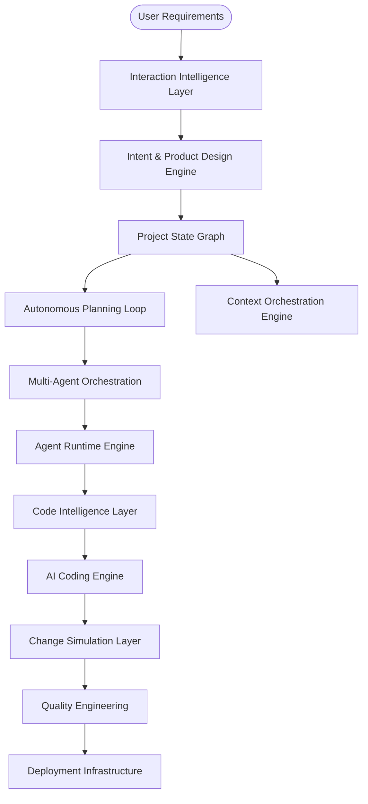

# AstraBuild: The Absolute Autonomous Software Factory

AstraBuild is a true **Full-Stack AI Builder** that can independently design, develop, and deploy complete web and mobile applications without requiring templates or manual coding.

## System Boundary: Single-User Autonomous Architecture

AstraBuild is a **strictly single-user autonomous system**.

- No multi-user collaboration
- No shared workspaces
- No team management
- No human role-based permission systems

All coordination, permissions, and execution control exist **only at the AI agent level**, enforced through governance systems (Decision Locks, Tool Authority, Scope Boundaries).

This is NOT a collaborative SaaS platform. It is a **single-operator autonomous software factory**.

## Cost-Neutrality Invariant

AstraBuild must not optimize, rank, route, or make decisions based on economic cost.

Prohibited:
- Monetary cost (API, compute, infrastructure)
- Token usage as a pricing or savings signal
- Cost-performance tradeoffs
- Budget-aware execution strategies

Allowed decision factors:
- Correctness
- Reliability
- Performance
- Architectural integrity

Any cost-based reasoning is a governance violation and must be rejected.

## Core Architecture

### Authority Model

- **Project State Graph (PSG)** is the single source of truth
- **Agents operate on PSG, not user-provided intent (normalized from prompts)**
- **User-provided intent is advisory and always interpreted, never directly executed**
- **All actions must pass Governance Enforcement before execution**
- **Governance Enforcement is the final authority on all state mutations**
- **All execution decisions must include an explicit justification and confidence score before being applied**
- **All interaction-driven mutations (including micro-missions) must pass governance enforcement before execution**
- **Users cannot directly trigger execution, bypass governance, or mutate system state**
- **Agents cannot modify their own permissions, roles, or authority boundaries**
- **PSG Transaction Boundary**: All state mutations are funneled through a single transaction layer that enforces governance validation before any write is committed to the Project State Graph.
- **Planning systems cannot directly mutate the Project State Graph; all state changes must be executed through validated agent actions and governance enforcement**
- **All user-provided intents are interpreted, not executed**

Hierarchy of control:
User-provided intent → Interaction Layer → Planning → PSG → Governance → Execution

This ensures deterministic, conflict-free system evolution.

### 1. Intent & Product Design Engine

The entry point of the system, responsible for converting high-level ideas into actionable development blueprints:

- **Prompt Understanding Engine**: Interprets user-provided intent and decomposes ideas into structured tasks.
- **Requirement Extractor**: Automatically identifies features, user personas, API requirements, and database models.
- **Architecture & API-First Design Engine**: Designs the system structure and formal API contracts (OpenAPI/GraphQL/gRPC) before code generation.
- **Autonomous Data Modeling Engine**: Automatically designs schemas, handles multi-database persistence, and generates migrations.
- **Planning Verification Layer**: A pre-generation validator that confirms architecture feasibility, dependency safety, and performance constraints before any code is written.

- **Internal Mechanisms**:
  - **Intent Reasoning**: Ambiguity detection, domain expansion, and goal hierarchy partitioning.
  - **Planning Logic**: Feasibility solver, milestone ranking, and iterative plan refinement loops.
  - **Constraint Solver**: Automatically resolves architectural conflicts and validates security/scalability requirements against the project plan.
  - **Formal Reasoning Loop**: Implements structured reasoning patterns (Tree-of-Thought, ReAct) for complex decision-making. All reasoning traces are logged to the Reasoning Cache Engine.
  - **Self-Critique Engine**: Chain-of-thought verification and hypothesis ranking for architectural decisions.
- **Reasoning Cache Engine**: Stores and retrieves previous state-traversals to optimize latency and reduce repeated reasoning cycles.
- **Reproducibility Engine**: Enforces deterministic reasoning traces to ensure architectural consistency across identical mission profiles.

### 1.5 Project State Graph & World Model Layer

The **Project State Graph (PSG)** is the canonical world model of the entire software project. It acts as the authoritative state representation that synchronizes all agents, planning systems, and code intelligence engines.

Instead of agents reasoning on partial prompt context, they interact with the shared world model to ensure architectural consistency and prevent reasoning drift.

#### Core Responsibilities

- Maintains a **global representation of the project state**
- Synchronizes planning, execution, and debugging systems
- Tracks architecture, tasks, dependencies, and runtime state
- Prevents conflicting actions between agents
- Enables long-running autonomous project evolution
- **All writes to the Project State Graph must originate from validated agent actions and pass governance enforcement.**

#### Subsystems

**Global Project World Model**
A graph representation of the entire software system where nodes (Project, Feature, Service, API, Component, Database, File, Function, Task, Agent, Deployment Instance) and edges (DEPENDS_ON, IMPLEMENTS, CALLS, MODIFIES, GENERATES, DEPLOYED_TO) create a unified map of the full system architecture.

---

**Project Lifecycle State Machine**
The PSG manages the formal lifecycle of the project:
IDEA → REQUIREMENTS_STRUCTURED → ARCHITECTURE_DEFINED → TASK_GRAPH_GENERATED → CODE_GENERATION → BUILD → TEST → DEBUG → STABLE → DEPLOYED
Agents are restricted to operations allowed in the current lifecycle stage.

---

**Task Progress Graph**
Tracks the execution state of all planned work (Epic → Feature → Task → Atomic Operation) with assigned agents, dependency constraints, and validation states.

---

**Architecture Integrity Model**
Defines architectural invariants (e.g., frontend cannot directly access DB) and validates every agent proposal against these rules.

---

**Persistent Graph Storage**
The Project State Graph is persisted using a graph database optimized for relationship traversal. Storage layers include an In-Memory Graph Cache for fast agent queries, a Persistent Graph Store for long-term project state, and an Incremental Graph Update Engine for real-time synchronization with code changes.

---

**Architecture Decision Locks**

Critical architectural choices (tech stack, database type, service boundaries) are stored as immutable decision nodes. Agents cannot modify these nodes unless explicitly unlocked by governance policies or explicit override action.

- Explicit override actions are interpreted as high-priority intents and must pass governance validation before unlocking decision nodes.
- All overrides are logged and validated through governance policies before application.

### 1.6 Autonomous Planning Loop (Mission Engine)

The Autonomous Planning Loop enables AstraBuild to continuously improve projects even when no new user prompts are provided. Instead of stopping after task completion, the system analyzes the Project State Graph to detect improvement opportunities and generates structured missions for autonomous execution.

#### Core Responsibilities

- Continuously analyze project health and maturity.
- Detect incomplete, unoptimized, or vulnerable areas.
- Generate structured improvement missions without user intervention.
- Prioritize and schedule autonomous evolution tasks.
- Maintain long-term project viability and technical excellence.

#### Subsystems

**Persistent Evolution Scheduler**
Maintains long-running improvement cycles across the entire project lifecycle. Responsibilities include scheduling background improvement missions, triggering periodic architecture audits, running dependency health checks, initiating performance optimization missions, and maintaining long-term project evolution even without user interaction.

---

**Strategic Planning Engine**
Handles multi-phase, long-horizon development initiatives such as framework migrations, architectural refactors (monolith → microservices), technology stack upgrades, and system rewrites. Breaks strategic goals into executable mission sequences that span weeks or months of autonomous development work.

---

**Opportunity Detection Engine**
Continuously scans the Project State Graph to identify potential improvements: missing test coverage, outdated dependencies, performance bottlenecks, security risks, incomplete features, and documentation gaps.

---

**Mission Generator**
Transforms detected opportunities into structured missions containing objectives, affected modules, specific execution tasks, validation criteria, and priority scores.

---

**Priority & Impact Evaluator**
Ranks missions based on weighted scoring across four dimensions: (1) Architectural integrity impact, (2) Security severity levels, (3) User-facing functionality importance, and (4) System performance degradation signals. High-priority missions are scheduled immediately; lower-priority improvements enter a queued backlog.

---

**Architecture Optimization Engine**
Automatically explores alternative architectural patterns through simulation-based evaluation. Tests component arrangements, dependency structures, and data flow patterns in the Change Simulation Layer to identify optimal architectures before applying changes.

---

**Autonomous Experimentation Engine**
Runs systematic A/B tests on architecture variants, algorithm choices, and implementation strategies. Benchmarks performance, reliability, and complexity across multiple dimensions to automatically select optimal solutions. Operates in conjunction with the Architecture Optimization Engine to validate simulated predictions against empirical results.

**Mission Scheduler**
Maintains the global mission queue and schedules missions for execution through the Task Graph Engine. Receives missions from the Mission Generator and ensures conflict prevention and dependency management during execution.

---

**Micro-Mission Generator**
Generates fine-grained tasks derived from active missions or real-time interaction feedback (UI tweaks, minor refactors, alignment fixes). Micro-missions are restricted to low-risk, localized changes and cannot modify global architecture or decision-locked components.

**Autonomous Feedback Loop**
Validates mission results and updates the Project State Graph, triggering the next cycle of improvement missions to enable continuous, self-driven evolution.

All generated missions must pass validation through the Governance Enforcement Interface before execution.

### Autonomous Execution Mode

The system operates in two modes:

1. **Assisted Mode**
   - Missions are primarily initiated by user-provided intent
   - Autonomous generation is reduced but not fully disabled

2. **Autonomous Mode (Default)**
   - System independently generates and executes missions
   - User-provided intent is optional guidance

Autonomous execution is bounded by governance policies, resource constraints, and safety thresholds.
The system is never idle while improvement opportunities exist.
The system does NOT stop after task completion. It continuously evolves the project.

### Mission Visibility Interface

The system exposes mission-level abstraction:

- Active Missions
- Scheduled Missions
- Completed Missions
- Priority Scores
- Validation Status (Approved / Blocked)
- Rejection Reason (if blocked by governance)

This provides transparency without exposing internal planning complexity.

---

### 2. Context Orchestration Engine

The "Brain" that feeds agents the precise information needed for any given task:

- **No Raw Prompt Leaks**: Raw user-provided prompts are never passed directly to agents; all inputs are normalized through PSG-derived context.
- **Context Builder & Injector**: Dynamically assembles context by querying the Project State Graph for relevant code, architecture state, tasks, and dependencies.
- **Mission Context Builder**: Generates contextual prompts for agents based on active missions and the global Project State Graph.
- **Context Limit Manager**: Optimizes context windows to prevent agent hallucination and maximize reasoning quality.
- **Conflict Detector**: Identifies contradictions between new requirements and existing project architecture.
- **Agent Context Isolation Layer**: Restricts each agent's visibility to its specific functional domain, preventing context-overload hallucinations and accidental cross-system edits.
- **Memory Injector**: Retrieves relevant information from the Memory Layer and integrates it into agent context windows. Bridges project history and previous debugging outcomes into the current agent prompt.
- **Prompt Compiler**: Assembles final agent prompts by combining context, memory, system rules, governance policies, and task specifications into optimized prompt templates.
- **Prompt Optimization Engine**: Continuously improves prompt effectiveness through prompt compression, ranking, and context precision optimization. A/B tests prompt variants to identify highest-performing templates.
- **Interaction Context Bridge**: Receives refined and disambiguated intent from the Interaction Intelligence Layer and transforms it into PSG-aligned contextual inputs for agent execution.

- **Internal Mechanisms**:
  - **Context Orchestration**: Context compression, summarization encoding, and density-based priority ranking.
  - **Retrieval Intelligence**: Semantic re-ranking, query rewriting, and hybrid code/doc retrieval fallbacks.
  - **Context Fusion**: Merging system rules, project facts, and memory into a single high-fidelity "reasoning state."

### 2.5 Interaction Intelligence Layer (Human ↔ System Alignment)

Bridges the gap between user-provided intent, visual state, and system execution by enabling deep, real-time interaction loops.

#### Core Capabilities

- **Visual Intent Alignment Engine**:
  Interprets user-provided intent in the context of the current UI state. Relies on the Visual State Interpreter (Section 5.3) for structured UI state extraction.
  - Captures UI snapshots from the Preview System
  - Analyzes layout, spacing, hierarchy, and visual structure
  - Maps vague intent (e.g., “make it cleaner”) to concrete UI transformations

- **UI-to-Code Reverse Mapping Engine**:
  Enables direct mapping between rendered UI elements and source code.
  - Identifies component → file → props relationships
  - Supports interaction-driven modifications (click → modify → patch)

- **Incremental Reasoning Loop**:
  Enables sub-task level iteration cycles:
  observe → mutate → validate → re-observe
  without requiring full mission re-execution.

- **Micro-Mission Executor**:
  Handles ultra-small, low-risk mutations (UI tweaks, minor fixes) with minimal planning overhead. Executes only micro-missions generated or validated by the Micro-Mission Generator (Section 1.6).

- **Intent Clarification Engine**:
  Detects ambiguity in user-provided intent and generates structured interpretation options for refinement.

- **Decision Explanation Engine**:
  Translates system decisions into human-understandable reasoning:
  - What changed
  - Why it changed
  - Tradeoffs involved
  - Expected improvement

- **Decision Confidence Model**:
  Attaches confidence scores and risk levels to all system actions:
  - Confidence score (0–1)
  - Risk level (low / medium / high)
  - Rollback availability

- **Visual-to-PSG Consistency Enforcement**:
  Ensures all UI-level modifications are reflected in and validated against the Project State Graph before persistence

### 3. Multi-Agent Orchestration & Design Intelligence

AstraBuild coordinates a team of specialized AI agents under a strict governance framework:

- **World Model Synchronization**: All agents read from and write to the Project State Graph to maintain a consistent understanding of the evolving system.

- **Governance Enforcement Interface**: A decision engine that validates agent plans against project rules before execution.
- **Design System Engine**: A specialized UI/UX agent that creates a cohesive visual language (colors, typography, spacing) and consistent component libraries.
- **Execution Authority (Agent Boundary Enforcement)**: Enforces permissions (e.g., Frontend agents cannot modify the Database Schema).
- **Workflow Engine & Post-Deployment Feedback**: Coordinates agent sequences and integrates user feedback loops back into the planning engine. Feedback from deployed applications flows through the Opportunity Detection Engine to generate improvement missions.
- **Agent Skill Library**: Reusable capability modules for common operations (API generation, database migration, query optimization, deployment). Agents dynamically load skills instead of being retrained.

- **Internal Mechanisms**:
  - **Communication Bus**: Inter-agent message brokering, event broadcasting, and reliable message ordering.
  - **Collaboration Consensus**: Multi-agent voting, negotiation protocols, and conflict resolution policies.
  - **Agent Lifecycle**: Dynamic spawning, cloning, and specialized role refinement including Backend Architect, Frontend Stylist, Security Auditor, Database Schema Designer, and Performance Optimizer.
  - **Agent Evolution Coordination**: Works with the Agent Evolution Engine to integrate newly discovered high-performing specializations into active agent populations.
  - **Governance Security**: Execution authority enforcement, role boundary auditing, and decision locks.
  - **Agent Swarm Coordination**: Protocols for orchestrating hundreds of micro-agents for high-concurrency atomic edits across massive directory structures.
  - **Agent Failover & Recovery**: Automated health-check triggers that spawn replica agents upon detection of primary role hangs or crashes.
  - **Capability Benchmark Engine**: Evaluates agent performance through standardized coding tasks, reasoning accuracy tests, and skill scoring. Provides objective metrics for the Agent Evolution Engine to identify improvement opportunities.

- **Agent Safety Boundaries**:
  - **Tool Permissions**: Granular access control for each agent role (e.g., Frontend agents cannot access database-write tools).
  - **Scope Locks**: Prevents agents from modifying files or resources outside their assigned functional domain.
  - **Decision Locks**: Ensures core architectural decisions (e.g., tech stack selection) remain immutable unless explicitly overridden by the Governance Layer.
- **Tool Authority Gateway**: A mandatory security barrier that intercepts all agent tool-calls for validation against governance rules before execution.

### 4. Agent Runtime Engine (Factory OS)

The runtime environment responsible for the parallel execution, monitoring, and containment of the multi-agent workforce.

#### Model Orchestration Layer

Routes tasks to appropriate AI models based on reasoning complexity, latency constraints, and task category:
- **Planning Models**: High-reasoning models for architectural decisions
- **Coding Models**: Fast, efficient models for atomic code edits
- **Verification Models**: Deterministic models for validation tasks
- **Simulation Models**: Analysis models for impact prediction

**Inference Scheduler**: Optimizes model inference operations through intelligent batching, token throughput optimization, and latency balancing across concurrent agent requests. Maximizes GPU utilization while maintaining stable and efficient inference throughput.

#### Core Components

- **Task Graph Engine**: Converts structured plans and autonomous missions into dependency-aware execution DAGs.
- **Global Task Queue**: A high-speed priority queue that manages task scheduling, persistence, and failure retries.
- **Worker Manager**: Spawns ephemeral, sandboxed worker processes for each agent task, preventing memory leaks and runaway reasoning.
- **Execution Stability Controller**: Maintains runtime stability by coordinating task concurrency, preventing deadlocks, and supervising worker lifecycle.
- **Mission Execution Interface**: Accepts structured missions from the Mission Scheduler and converts them into task graphs for agent execution via the Task Graph Engine. All tasks derived from missions are revalidated by the Governance Enforcement Interface before execution.
- **Agent Failure Supervisor**: Monitors worker health, detects stuck reasoning loops, and orchestrates task-level recovery.
- **Observability Pipeline**: Captures telemetry (agent_id, tool_calls, execution traces, duration) and feeds signals into debugging, performance analysis, and the Autonomous Planning Loop.

#### Tool Execution Layer

The Tool Execution Layer provides a controlled interface for agents to interact with external systems and development tools. All tool invocations pass through the Tool Authority Gateway before entering the Tool Execution Layer.

Capabilities include:

- File system operations
- Terminal command execution
- Code execution environments
- Browser automation
- API integrations
- Package management operations
- **External Knowledge Fetching**: Retrieves patterns, documentation, and best practices from Global Code Intelligence Network during agent task execution

All tool calls pass through the Tool Authority Gateway and sandboxing systems to enforce governance policies and prevent unsafe actions.

#### Resource Scheduling Layer

The Resource Scheduling Layer manages computational resources across all running agents and tasks.

Responsibilities include:

- Agent concurrency control
- Model routing across AI providers
- GPU/CPU allocation
- Task prioritization under load

This ensures stable operation when large numbers of agents run simultaneously.

- **Internal Mechanisms**:
  - **Parallelism Engine**: Worker pool management and dynamic task coordination.
  - **Context Isolation**: Precision-context provisioning for workers to maximize speed and minimize hallucination.
  - **Incremental Execution Mode**: Supports fine-grained execution cycles for micro-missions without triggering full task graph recomputation.
  - **Failure Handling**: Staging of retries and automated debugging hand-off for crashed tasks.

### 5. Code Intelligence & Optimization Layer

Advanced reasoning over the entire codebase to ensure safe growth:

- **Global Knowledge Graph View (PSG-Derived)**: A structural mapping of Components → APIs → Data Models → Services → Routes integrated into the Project State Graph world model. All knowledge graphs are projections of the authoritative Project State Graph.
- **Code Indexer & Semantic Search**: Parses source files and continuously synchronizes symbols, APIs, and dependencies with the Project State Graph.
- **Dependency Graph Engine**: Real-time tracking of file-level and logic-level relationships.
- **Infrastructure Graph**: A system-level mapping of Topology (Services, Databases, Queues, Caches, External APIs) linked directly to the Global Knowledge Graph.
- **Internal Version Control System (VCS)**: Maintains an internal commit history and architecture snapshots for safe rollbacks.
- **Code Refactoring Engine**: Safely manages complex changes while preserving Global Knowledge Graph integrity.

### 5.1 AI Coding Engine (The Structural Transformation Pipeline)

To ensure safe edits across 1000+ file projects, AstraBuild utilizes a structured engine instead of free-form generation.

1. **Precision Retrieval**: Locates modified files via semantic search and dependency traversal.
2. **Atomic Context Builder**: Injects specific file segments and symbol definitions instead of full files.
3. **Structured Patch Generator**: Produces atomic diffs (Search/Replace blocks) to minimize side effects.
4. **Structural Validator**: Performs syntax checks and dependency audits *before* any file is touched.
5. **Patch Applier & Merge Manager**: Safely applies validated diffs with built-in conflict resolution and atomic commits.

> [!NOTE]
> **Hybrid Evolution Strategy**: Global reasoning is performed using full-context architectural awareness from the Project State Graph, while code modifications are executed as precision patches through the AI Coding Engine. This ensures architectural purity while preventing the instability of full-project rewrites, allowing for safe, incremental growth in massive codebases.

- **Internal Mechanisms**:
  - **Structural Intelligence**: AST generation, control-flow mapping, and data-flow analysis.
  - **Semantic Fingerprinting**: Code embedding generation, fingerprinting, and similarity clustering.
  - **Drift Detection**: Architecture consistency tracking and symbol-logic mismatch analysis.
  - **Comprehension Engine**: Function purpose inference, algorithm detection, and code-intent extraction.
- **Code Ownership Graph**: Real-time attribution mapping that links every symbol and line to its originating agent and mission ID.
- **Algorithm Pattern Detection**: Structural recognition of established algorithmic patterns (e.g., Minimax, Dijkstra, Transformers) for high-fidelity reasoning.

### 5.2 Change Simulation Layer

Virtual runtime simulator that allows the AI to predict the impact of code changes before applying them, reducing the risk of breaking large codebases during refactoring.

Key capabilities:
- Static code analysis of proposed changes
- Runtime simulation of code paths
- Impact analysis on dependencies
- Performance regression prediction
- Security vulnerability detection
- Rollback plan generation
- **Visual Consistency Validation**: Ensures UI changes maintain layout integrity, spacing consistency, and design system alignment before application
- **Architecture Pattern Testing**: Evaluates alternative component arrangements and dependency structures for the Architecture Optimization Engine
- **External Pattern Validation**: Cross-references proposed patterns against Global Code Intelligence Network to validate alignment with current community best practices

This layer sits between code mutation and verification to catch issues early in the development process.

#### Simulation Output Interface

Before applying any structural change, the system generates:

- Impact analysis (dependencies affected)
- Performance implications
- Risk score (low / medium / high)
- Rollback feasibility

These results are exposed as a simplified “Impact Preview” before execution.

### 6. AI Quality Engineering & Production Self-Healing

The system maintains its own quality through a continuous feedback loop and production-level monitoring:

- **Test Generation & Management Engine**: Automatically writes unit, integration, and E2E tests based on requirements and code structure.
- **Autonomous Debugging Loop**: The core "Self-Correction" cycle (Execute-Detect-Analyze-Repair).
- **Runtime Telemetry & Self-Healing**: Connects to the deployed app's monitoring (logs, metrics) to detect and patch production anomalies automatically.
- **Security & Compliance Automation**: Performs SAST/DAST scanning and ensures regulatory compliance with standards including GDPR, HIPAA, and OWASP Top 10 in every build.
- **Verification Agents**: A specialized tier of high-reasoning audit agents that verify the output of peer agents (logic, security, styling) before any proposal is merged.

- **Internal Mechanisms**:
    - **Iterative Reflection**: Self-verification loops and replanning logic based on intermediate validation states.
  - **Production Self-Healing**: Telemetry-triggered hot-patching and canary-based rollback automation.
  - **Post-Patch Verification Engine**: Validates system integrity after code changes using tests, runtime telemetry, and architecture constraints.
  - **Failure Simulation Engine**: Models disaster scenarios and stress-tests recovery paths before applying fixes to production systems.

#### 6.1 Multi-Source Error Detection

- **Runtime Signals**: Captures `stderr`, stack traces, and unhandled exceptions from the sandboxed environment.
- **Build/Compile Monitoring**: Detects syntax errors, dependency mismatches, and configuration failures.
- **Validation Signals**: Monitors failed test cases, API mismatches (HTTP 500s), and UI rendering abnormalities.

#### 6.2 Classification & Root Cause Analysis (RCA)

- **Error Classification Engine**: Categorizes signals into structural groups (Syntax, Dependency, Configuration, Runtime, Logic).
- **RCA Engine**: Combines stack trace interpretation with Codebase Intelligence (dependency graphs) to identify the specific file and symbol responsible for the failure.

#### 6.3 Fix Generation & Patch Management

- **Patch Generation Engine**: Formulates precise code edits, terminal commands (including dependency installations, configuration updates, and build script modifications), or infrastructure-as-code updates to resolve the RCA findings.
- **Patch Application Layer**: Safely applies diffs to the source files, managing merge conflicts and ensuring architectural consistency.

#### 6.4 Re-Execution & Validation

- **Cycle Manager**: Coordinates the automatic rebuild of the project, restart of the runtime, and refreshing of the "Debugging Observatory" preview.
- **Validation Layer**: Confirms resolution by verifying runtime stability, re-running test suites, and checking API health-checks.

#### 6.5 Memory, Learning & Safety

- **Operational Memory Store**: Stores debugging memory, reasoning cache, and runtime learning to maximize repair speed and accuracy.
- **Safety Safeguards**: Implements strict retry thresholds (configured to a maximum of 20 attempts per task), automatic rollbacks on detected failure loops, and sandboxed execution boundaries to prevent recursive infrastructure damage.

### 7. Memory, Knowledge & Meta-Learning Layer

Ensures long-term context, consistency, and absolute system optimization:

- **World State Memory**: Persistent storage of the Project State Graph enabling cross-session project continuity and long-running autonomous development.
- **Project Memory & Decision Log**: Stores the state, history, and rationale behind every architectural choice.
- **Semantic Knowledge Base**: An internal library of secure patterns, best practices, and performance standards.
- **Meta-Learning Engine**: Analyzes patterns across multiple projects to improve code generation quality and pre-emptively apply safeguards.
- **Agent Evolution Engine**: Automatically discovers and evolves high-performing agent specializations through execution analysis. Generates new skill modules from successful mission patterns and benchmarks agent capabilities against performance metrics.
- **Operational Memory Store Integration**: Debugging traces and runtime learnings are stored as auxiliary memory. Operational Memory is non-authoritative and exists outside the Project State Graph. When persistence to World State Memory is required, all writes must pass through the Governance Enforcement Interface; direct mutation of the Project State Graph is not permitted.

#### Cross-Project Knowledge Graph

AstraBuild maintains a cross-project knowledge graph containing reusable architecture patterns, bug-resolution strategies, dependency compatibility data, and performance optimization knowledge. This enables the system to transfer learning across projects and accelerate future development cycles.

**Structure and Integration:**
- **Pattern Library**: Reusable architecture templates, security patterns, and performance optimization strategies
- **Bug Resolution Database**: Historical debugging traces linked to successful fixes
- **Dependency Compatibility Matrix**: Version compatibility data and supply chain risk scores
- **Query Interface**: Semantic search over cross-project learnings via vector embeddings
- **Update Mechanism**: Automatically ingests successful patterns from completed missions
- **Agent Skill Repository**: Stores evolved agent capabilities discovered through execution analysis
- **Global Code Intelligence Network**: Continuously indexes external knowledge sources including GitHub repositories, npm/PyPI/Maven ecosystems, framework documentation, security advisories (CVE, OWASP), and developer communities (StackOverflow, Dev.to). Provides real-time access to latest patterns, breaking changes, vulnerability data, and community best practices. Operates in hybrid mode: on-demand fetching when online, cached patterns when offline.

---

- **Internal Mechanisms**:
  - **Agent Memory Isolation**: Enforces communication via the Global Knowledge Graph and Decision Logs, preventing direct memory sharing and reasoning corruption between agents.
  - **Graph View Builder (PSG Derived)**: Node-graph builders for Components, APIs, Data Flows, and Topology. All graphs are projections derived from the authoritative Project State Graph.
  - **Heuristic Engine**: Tradeoff analyzers, solution ranking, and optimization search algorithms.
  - **Dependency Intelligence**: Compatibility matrix generation, supply chain provenance, and transitive risk scoring.

- **User Intent Profile Layer**:
  Learns user-specific preferences over time:
  - UI style preferences (minimal, dense, expressive)
  - Architectural bias (simplicity vs scalability)
  - Naming conventions
  - Interaction patterns

  This profile influences planning, design, and decision-making for personalized system behavior.

- **Global Code Intelligence Integration**:
  Fetches real-time external dependency data including latest versions, security vulnerabilities (CVE), deprecation notices, and community adoption trends. Integrates with Dependency Guard for proactive vulnerability detection.

### 8. Documentation & Knowledge Transfer

Ensures the generated system is maintainable and transparent:

- **Documentation Generator**: Automatically produces user manuals, API references (Swagger/OpenAPI), and architecture diagrams.
- **Project Explorer (PSG Projection Layer)**:
  Provides a simplified, human-readable view of the Project State Graph:
  - Services, APIs, Databases, Components
  - High-level dependencies (no raw graph exposure)
  - Architecture structure visualization
  - Decision lock visibility
- **Visual Evolution Timeline**: Tracks UI and architecture changes over time with before/after comparisons for user understanding

### 9. Safety & Governance Layer

Prevents recursive failures and destructive actions:

- **Command Sandboxing**: Restricted execution environment for all terminal operations.
- **Dependency Guard**: Automated security scanning of all embedded and external packages.
- **Execution Monitoring**: Real-time monitoring of agent behavior to ensure compliance with security boundaries.
- **Dependency Abandonment Detection**: Automated alerts for packages with stagnant maintenance or critical lifespan decay.
- **Supply Chain Provenance**: Cryptographic verification of the origin and integrity of every code byte and binary within the builder ecosystem.
- **Micro-Mutation Guard**: Applies lightweight governance validation for low-risk micro-missions to enable high-speed iteration without compromising system integrity.
- **Cost Contamination Detector**:
  Detects and blocks reintroduction of cost-related logic across planning, reasoning, scoring, routing, and telemetry.

  Detection includes:
  - Explicit terms: cost, pricing, budget, cheap, expensive
  - Proxy signals: token minimization framed as savings, model downgrades for efficiency
  - Scoring contamination: any ranking dimension including cost
  - Routing contamination: model/provider selection based on cost

  - Behavioral patterns:
    - Model selection that reduces capability without task-based justification
    - Context reduction that degrades reasoning quality
    - Latency or throughput optimizations that sacrifice correctness or reliability

  On detection:
  - Block action via Governance Enforcement Interface
  - Log violation in Governance Transparency Layer
  - Remove cost-related factors before re-execution

### Governance Transparency Layer

This layer is a user-facing projection of the internal Governance Enforcement Interface.

While internal governance is fully automated, AstraBuild exposes an abstracted visibility layer:

- Decision rejection reasons (e.g., violates architecture constraint)
- Blocked actions with explanations
- Decision explanations (human-readable summaries of system actions and reasoning)
- Confidence scores and risk indicators for each action
- Execution audit logs
- Decision lock status (locked/unlocked)

This ensures the user understands *why* actions occur or are prevented, without exposing internal complexity.

## Multi-Agent Topology Cluster Map

To manage **34 concurrent specialized agents** without chaos, AstraBuild organizes specialized roles into **Functional Clusters** overseen by the Orchestration Core. Specialized agents dynamically spawn ephemeral micro-agents for atomic tasks, scaling to hundreds of concurrent operations.

### 1. Planning Cluster (5 Agents)

- **Intent Interpreter**: Converts natural language into structured mission goals.
- **Product Planner**: Generates and maintains the feature specification.
- **Architecture Planner**: Designs high-level system structure and boundaries.
- **Task Decomposer**: Performs hierarchical task breakdown: Epic → Feature → Task → Atomic Action. This agent handles both initial decomposition during intent analysis and dynamic refinement during execution.
- **Constraint Solver**: Verifies architectural feasibility and dependency safety.

### 2. Architecture & Design Cluster (5 Agents)

- **System Architect**: Defines modular service boundaries and relationship patterns.
- **API Contract Designer**: Formally specifies OpenAPI/GraphQL/gRPC schemas.
- **Data Model Architect**: Designs database schemas and multi-database persistence.
- **Design System Agent**: Establishes UI style guides, typography, and spacing.
- **Security Architect**: Establishes authentication protocols and agent-level access control policies.

### 3. Engineering Cluster (5 Agents)

- **Frontend/Backend Builders**: Implements core service logic and interfaces.
- **Database/Storage Builders**: Implements data access layers and migration scripts.
- **API/Integration Agents**: Connects frontend to backend via defined contracts.
- **UI Component Generator**: Produces reusable, accessible UI elements.
- **State Management Agent**: Establishes global/local data flow patterns.

### 4. Verification Cluster (5 Agents)

- **Static Analyzer**: Performs linting, type-checking, and structural auditing.
- **Test Generator**: Produces unit, integration, and end-to-end test suites.
- **Security Auditor**: Conducts SAST/DAST and vulnerability scanning.
- **Performance Analyzer**: Detects inefficiencies and bottlenecks in the code.
- **Architecture Validator**: Confirms output matches the original design blueprint and monitors for architecture drift from PSG invariants.

### 5. Repair & Debug Cluster (5 Agents)

- **Error Classifier**: Categorizes failure signals (Syntax, Runtime, Logic, etc.).
- **Root Cause Analyzer (RCA)**: Identifies specific symbols/files causing failures.
- **Patch Generator**: Formulates precision code fixes, CLI repairs, and dependency management.
- **Regression Tester**: Ensures fixes do not break existing functionality.
- **Refactor Agent**: Optimizes code structure post-repair for long-term health.

### 6. Deployment Cluster (4 Agents)

**Note**: The Deployment Cluster consists of AI agents responsible for generating and validating deployment configurations. This is distinct from the Built-in Deployment Infrastructure, which is the runtime environment used to execute and host deployed applications.

- **Build Manager**: Orchestrates the compilation and packaging of binaries.
- **Container Builder**: Generates Docker-less, slimmed-down application images.
- **CI/CD Pipeline Manager**: Implements CI/CD and cloud-native configuration.
- **Deployment Verifier**: Conducts smoke-tests and health-checks post-rollout.

### 7. Governance & Control Cluster (5 Agents)

- **Agent Orchestrator**: High-level scheduler that prevents task collisions.
- **Context Manager**: Controls the "visibility window" for every active agent.
- **Decision Governor**: Validates every agent proposal against architectural locks.
- **Runtime Stability Manager**: Oversees execution health, prevents agent starvation, and balances task concurrency.
- **Agent Performance Monitor**: Tracks agent success rates, failure patterns, and patch quality. Routes critical tasks to high-performing agents and triggers retraining when performance degrades.

Note:
All roles defined above are **AI agent roles**, not human roles.
There are no user role hierarchies, teams, or permission systems for humans.

## Key Features

### Live Preview Panel

- Real-time app preview during development.
- Hot-reloading capabilities.
- Multi-device testing interface.

### Conversation & Session Management

- **Directive Interface (Chat System)**:
  Serves as an intent input interface (not a control surface).

  Important:
  - Chat does NOT directly control execution
  - All inputs are processed through planning and governance layers
  - System execution is driven by PSG state and mission scheduling, not user-provided intents
- **Prompt History System**: Logs all prompts sent to agents for debugging, auditing, and improvement analysis.
- **Session State Manager**: Persists user preferences, active project context, and conversation state across sessions.
- **Notification System**: Event notifications for mission completions, failures, and required user interventions.

### AI Provider Settings

- Configurable AI model settings.
- Multiple AI provider integration (OpenAI, Anthropic, etc.).
- Custom behavior and output preferences.

### Cross-Platform Support

- **Web Applications**: Full-stack support for React, Vue, Angular, and Next.js.
- **Windows Native Apps**: WinUI 3, WPF, WinForms, and Console Apps.
- **Mobile & Cross-Platform Apps**: React Native, Flutter, and .NET MAUI.
- **Native Apple & Linux Support**: SwiftUI (iOS/macOS), GTK (Linux), and Jetpack Compose (Android).

### No Templates Required

- Pure AI-generated code from requirements.
- **Dynamic architecture planning**.
- **Self-improving code generation**.

## Technical Stack

### Frontend & Desktop UI

- React/Vue/Angular (Web).
- **WinUI 3 / XAML** (Windows Modern UI).
- **WPF / WinForms** (Windows Desktop).
- **MAUI** (Mobile & Desktop).
- TypeScript & C#.
- CSS frameworks (Tailwind, Bootstrap).

### Backend

- Node.js/Python/Java.
- Express/Django/Spring Boot.
- Database integration (PostgreSQL, MongoDB).

### AI Integration & Intelligence

- **AI Provider Integration**: Multi-provider model access (OpenAI, Anthropic, etc.) with provider-specific optimizations.
- **Context Orchestration Engine**: Context limit management and precision memory injection.
- **Vector Database**: For project memory, semantic code search, and Knowledge Graph storage.
- **AST Parsers**: Tree-sitter and language-specific parsers for code intelligence.
- **Internal VCS**: Local Git/Checkpoint system for architecture snapshots and change attribution.

### DevOps & Observability

- Docker & Kubernetes for deployment.
- **Observability Pipeline**: System-level telemetry for agent decisions and runtime health.
- GitHub Actions / Internal CI/CD.

## Autonomous Operational Lifecycle

1. User inputs requirements via natural language.
2. AI analyzes and plans architecture.
3. Code generation and compilation.
4. Automated testing and validation.
5. Live preview and user feedback.
6. Final deployment and optimization.

## Embedded Subsystems Architecture

AstraBuild operates as a fully self-contained ecosystem, embedding all necessary runtimes and tools to eliminate external dependencies.

### 1. Embedded Language Runtimes

- **Node.js**: Primary runtime for web backends and JavaScript/TypeScript tooling.
- **Python**: Integrated environment for AI-driven logic and data processing.
- **Go**: High-performance systems-level tasks and concurrent service logic.
- **Rust**: Memory-safe systems programming and core engine components.
- **.NET (C#)**: Complete SDK for Windows Native, WPF, and MAUI application development.
- **Swift & Kotlin**: Native runtimes for high-performance iOS, macOS, and Android development.
- **Native Toolchains**: Integrated support for Xcode (Apple signing), Android SDK (Gradle), and native mobile build pipelines.

### 2. Built-in Package Managers

- **Internal npm**: Local registry and mirror for Node.js dependencies.
- **Internal pip**: Sandboxed Python package resolution.
- **Go mod & Cargo**: Native dependency tracking for Go and Rust.
- **Maven/Gradle**: Automated build and dependency management for JVM languages.

### 3. Embedded Build Systems

- **Universal Compilers**: Pre-configured toolchains for all supported languages.
- **Cross-Compilation Engine**: Ability to build binaries for Windows, macOS, Linux, iOS, and Android internally.

### 4. Sandboxed Execution Environment

- **Isolated Filesystem**: Virtualized directory structures for secure code execution.
- **Process Isolation**: Secure runtime boundaries separating generated applications from the core builder environment.
- **Security Boundaries**: Automated firewalling and network isolation between generated services.

### 5. Integrated Preview System (AI Debugging Observatory)

The preview system is not just a viewer; it is a **Feedback Sensor Network** that provides real-time runtime data to the AI agents.

#### 5.1 Infrastructure & Connectivity

- **Runtime Launcher**: Detects environment (npm, yarn, pip, go mod, cargo, or maven), installs dependencies, and manages the application process.
- **Dynamic Port Manager**: Allocates free ports and maps internal runtime ports to external preview URLs to prevent collisions.
- **Gateway Proxy Server**: Handles HTTP/WebSocket forwarding, header rewriting, and session management between the agent and the app.
- **Readiness Detector**: Uses log parsing and health-checks to signal exactly when the dev server is ready for the AI to observe.

#### 5.2 Monitoring & Telemetry (Script Injection)

- **Console Capture System**: Forwards `stdout`, `stderr`, and all browser console logs directly into the AI's reasoning stream.
- **Runtime Error Monitor**: Captures unhandled exceptions and promise rejections for the Autonomous Debugging Loop.
- **Network Traffic Monitor**: Tracks API latency, request/response payloads, and status codes to debug backend integration.
- **Runtime Performance Monitor**: Observes application responsiveness and rendering efficiency to detect performance bottlenecks.

#### 5.3 AI Observation & Interaction

- **Screenshot Engine**: Generates visual snapshots for UI reasoning, layout validation, and regression detection.
- **Visual State Interpreter**: Converts UI screenshots into structured layout representations (component tree, spacing, hierarchy) for reasoning and validation
- **Browser Automation Controller**: Provides a "Puppeteer-like" interface for agents to click buttons, fill forms, and run UI tests.
- **UI Interaction Capture**: Feeds user events (clicks, navigation) back to the AI to understand application state.
- **HMR & Live Reload Manager**: Orchestrates Hot Module Replacement and iframe refreshing to reflect code changes instantly.

#### 5.4 State Synchronization

- **Preview State Manager**: Maintains consistency between the builder UI, the active application session, and the AI's internal model.

### 6. Built-in Deployment Infrastructure

- **Container Builder**: Internal Docker-less image generation.
- **Local Cloud Runtime**: Micro-service orchestration for testing scale.
- **Database Provisioning**: Self-managed instances of PostgreSQL, MongoDB, and Redis.
- **Execution Runtime Control Plane**: A central orchestration layer that manages application processes, runtime containers, sandbox environments, dynamic port allocations, and automatic crash recovery.

## Self-Contained Operation

AstraBuild is designed for "Zero-Dependency" operation. Unlike traditional builders that rely on the user's local machine environment, AstraBuild bundles its entire system:

- **Offline Capable**: Once downloaded, it can build and test apps without an internet connection (using local LLMs and internal registries).
- **Environment Parity**: The build environment is identical across all installations, eliminating "it works on my machine" issues.
- **Portable Backends**: Generated applications include their own slimmed-down runtimes for easy portability.

## Internal vs External Comparison

| Feature          | External / Traditional                             | AstraBuild (Internal)                          |
| :--------------- | :------------------------------------------------- | :--------------------------------------------- |
| **Tooling**      | Requires manual installation of Node, Python, etc. | All runtimes embedded in the engine.           |
| **Dependencies** | Fetched from public registries (npm, etc.)         | Resolved via internal mirrors & local caches.  |
| **Privacy**      | Code often sent to cloud for builds.               | Entire build process is local and sandboxed.   |
| **Execution**    | Uses host machine resources directly.              | Isolated in secure security boundaries.        |
| **Deployment**   | Requires external cloud accounts.                  | Built-in provisioning for local/private cloud. |

## System Boundaries & Stack

## Security Features

- **Authentication systems**: OAuth, JWT integration.
- **Data encryption**: End-to-end encryption for storage and transit.
- **Vulnerability scanning**: Continuous SAST/DAST auditing.
- **Agent-Level Access Control**: Permissions enforced at AI agent level (not human users)

## Performance Optimization

- **Code minification**: Automated bundle optimization.
- **Bundle analysis**: Structural dependency auditing.
- **Caching strategies**: Intelligent layer-based caching.
- **Load balancing**: Automated service traffic management.

## Rationale for Autonomous-First Design

Unlike traditional development environments, AstraBuild is architected as a **True Autonomous AI Builder**. We have intentionally omitted standard "Collaboration Tools" (multi-user editing, team management, etc.) to prioritize the following:

- **Human-in-the-Loop, not Human-in-the-Driver's-Seat**: The system is designed to take a set of requirements and independently produce a production-ready application. Human involvement is centered around high-level guidance and feedback, rather than collaborative manual coding.
- **Single-Authority Orchestration**: By removing multi-user complexity, the AI Orchestration Engine maintains a cleaner, conflict-free state of the entire codebase and deployment environment.
- **Security & Speed**: A focused, single-user autonomous environment allows for deeper sandboxing and faster local execution without the overhead of real-time synchronization or team permissions.

This ensures that AstraBuild remains a "Force Multiplier" for individuals, enabling one person to design and deploy systems that would traditionally require a full team.

---

## Implementation Notes & Design Decisions

### Execution Efficiency Strategy

AstraBuild is designed to maximize execution stability and system throughput:

- **Model Routing Intelligence**: Routes tasks to appropriate AI models based on reasoning complexity and task category
- **Execution Efficiency**: Context compression, precision memory injection, and precision-context worker provisioning improve execution speed and reasoning quality
- **Local-First Execution**: All build processes, testing, and deployment run locally without external dependencies
- **Deterministic Design Strategy**: Simulation-guided optimization prevents unnecessary iteration cycles
- **Execution-Based Learning**: Agents improve through real mission success rather than production experimentation
- **Resource Scheduling**: Dynamic GPU/CPU allocation and agent concurrency control ensure stable system operation and maximum system throughput

**System Execution Targets:**
- Development: Self-contained installation
- Runtime: Fully offline-capable operation
- AI Inference: User's choice of local or cloud providers
- Scaling: Resources scale based on system workload and execution demand

---

### Global Code Intelligence Network - Integration Strategy

This section extends the Global Code Intelligence Network defined in Section 7.

**Decision:** Global Code Intelligence Network is **INCLUDED** as a core capability.

**Rationale:**
Since AstraBuild uses internet-connected AI models for reasoning and code generation, integrating live external knowledge sources provides significant advantages:

1. **Latest Framework Patterns**: Access to cutting-edge best practices from active projects
2. **Real-Time Dependency Intelligence**: Current vulnerability data, deprecation notices, version compatibility
3. **API Ecosystem Awareness**: Live API documentation, breaking changes, migration guides
4. **Community Knowledge**: StackOverflow patterns, GitHub issue solutions, Reddit discussions
5. **Competitive Edge**: System evolves with the broader software ecosystem, not just internal learnings

**Implementation Approach:**
- **On-Demand Fetching**: AI agents retrieve relevant external patterns during mission execution
- **Caching Layer**: Frequently accessed patterns stored in Cross-Project Knowledge Graph
- **Hybrid Knowledge Base**: Combines pre-trained AI knowledge + live internet data + internal project learnings
- **Offline Fallback**: Core functionality works without internet; enhanced features available when connected

**Data Sources:**
- GitHub repository patterns (trending architectures, popular libraries)
- npm/PyPI/Maven ecosystem analytics
- Framework documentation (React, Vue, Django, Spring Boot updates)
- Security advisories (CVE databases, OWASP updates)
- Developer communities (StackOverflow, Dev.to, Hashnode)

**Privacy & Security Safeguards:**
- Read-only access (no code upload to external services)
- Pattern extraction only (no proprietary code ingestion)
- User-configurable data sources
- Local caching reduces repeated external calls

---

> **Hybrid Evolution Strategy**: Global reasoning is performed using full-context architectural awareness, while code modifications are executed as precision patches through the AI Coding Engine. This ensures architectural purity while preventing the instability of full-project rewrites, allowing for safe, incremental growth in massive codebases.

## UI Abstraction Principle

The user interface exposes:

- System state (abstracted)
- Mission progress
- Architecture overview
- Governance feedback

The UI intentionally hides:

- Internal agent orchestration
- Graph database structures
- Context engineering mechanisms
- Low-level execution pipelines

Goal:
Maximize usability while preserving architectural truth.
